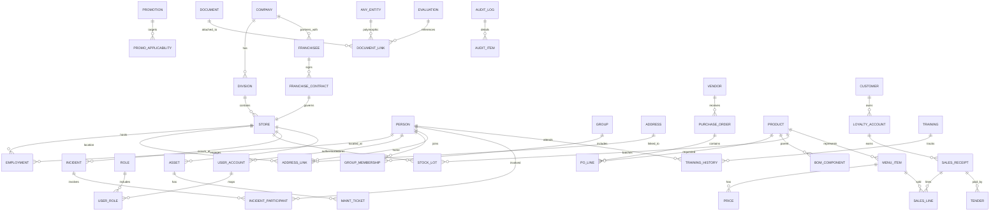
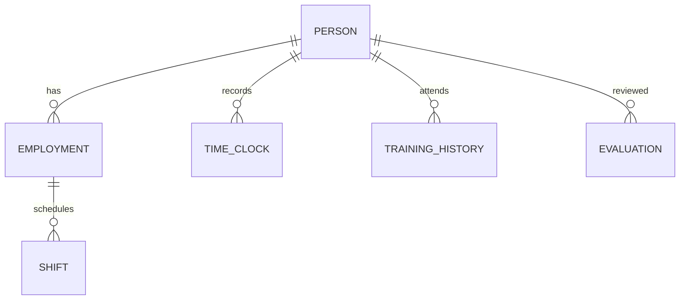
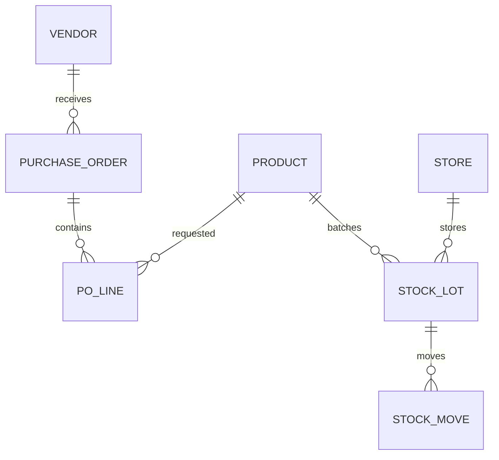
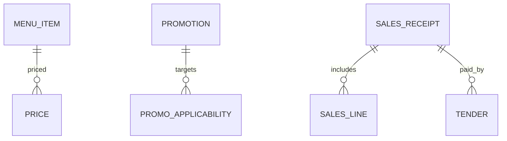
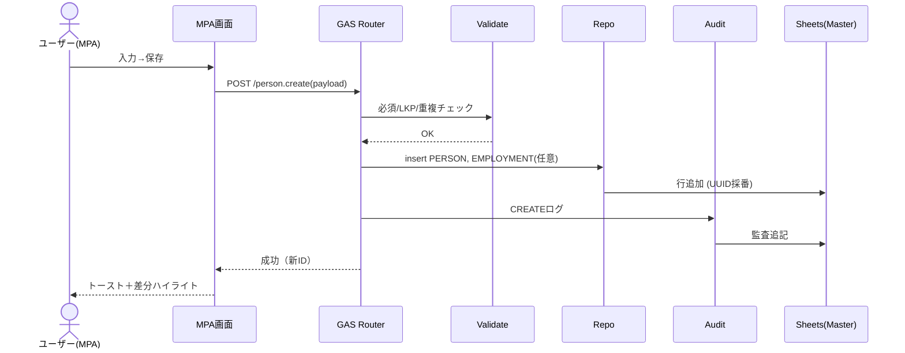
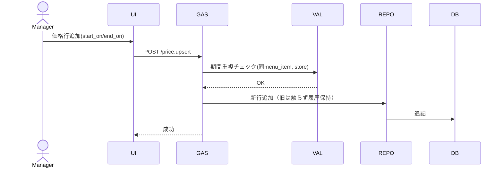
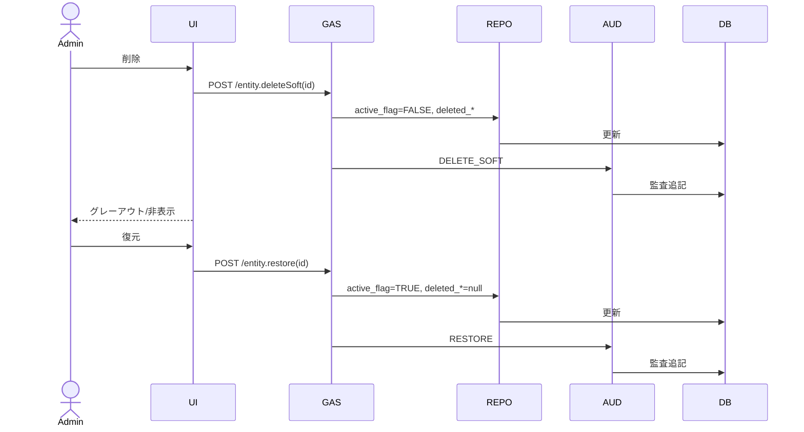
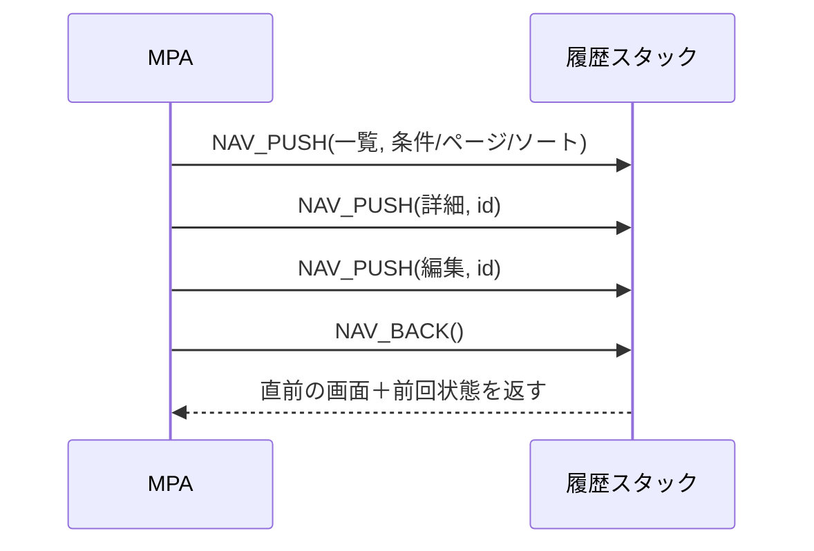

# KUROZUMI v1.1

> 本社（HQ）＋全国FC（直営50／FC50）を、Googleスプレッドシート＋Apps Script（KUROZUMIフロント）で統合管理するための**完全仕様**。本書は、管理項目の全量、ER（概念→論理）、シート構成（物理定義）、CRUD/監査/ソフト削除、UI/UX、運用・ガバナンス、拡張・可観測性までを**実装レベル**で提示する。
## 目次（Hyperdrive Overview）

1. [0. スコープ/原則](#0-スコープ原則)
2. [1. 管理ドメインと管理項目（完全網羅）](#1-管理ドメインと管理項目完全網羅)
3. [2. ERモデル（Mermaid）](#2-erモデルmermaid)
4. [3. スプレッドシート：シート構成とカラム定義（実装用）](#3-スプレッドシートシート構成とカラム定義実装用)
5. [4. データ検証・条件付き書式（代表例）](#4-データ検証条件付き書式代表例)
6. [5. RBAC（ロール×権限マトリクス：例）](#5-rbacロール権限マトリクス例)
7. [6. 代表ワークフロー（時系列）](#6-代表ワークフロー時系列)
8. [7. Apps Script（実装骨子）](#7-apps-script実装骨子)
9. [8. UI/UX仕様（Ironman×AKIRA）](#8-uiux仕様ironmanakira)
10. [9. KPI/ダッシュボード（定義）](#9-kpiダッシュボード定義)
11. [10. パフォーマンス/スケーラビリティ](#10-パフォーマンススケーラビリティ)
12. [11. セキュリティ/プライバシー](#11-セキュリティプライバシー)
13. [12. 監査/バックアップ/DR](#12-監査バックアップdr)
14. [13. 命名規約/コード体系](#13-命名規約コード体系)
15. [14. 導入計画/移行](#14-導入計画移行)
16. [15. あなたの既存ブックとの差分チェックリスト](#15-あなたの既存ブックとの差分チェックリスト)
17. [16. 付録：Mermaidサブ図（用途別）](#16-付録mermaidサブ図用途別)
18. [17. MPA（Multi‑Page App）ナビゲーション要件 — 戻るボタン常設](#17-mpaマルチページ-appナビゲーション要件--戻るボタン常設)
19. [18. UI/ナビ関連 ER拡張（Mermaid）](#18-uiナビ関連-er拡張mermaid)
20. [19. スプレッドシートへの影響 — 追加シートは必要？](#19-スプレッドシートへの影響--追加シートは必要)
21. [20. 実装ガイド（Backボタン）](#20-実装ガイドbackボタン)
22. [21. 変更サマリ（あなたの依頼を反映）](#21-変更サマリあなたの依頼を反映)
23. [GitHub向け README.md（MPA×GAS×Sheets／フルスクラッチ版）](#github向け-readmemdmpagasheetsフルスクラッチ版)
24. [22. システムフロー図（MPA × GAS × Google Sheets＝Master DB）](#22-システムフロー図mpa--gas--google-sheetsmaster-db)
25. [23. 機能関連図（業務ドメイン相互依存）](#23-機能関連図業務ドメイン相互依存)
26. [24. 主要ユースケースのシーケンス（MPA×GAS×Sheets）](#24-主要ユースケースのシーケンスmpagas×sheets)
27. [25. データフロー図（DFD-L1）](#25-データフロー図dfd-l1)
28. [26. ER図（要点再掲：Spreadsheet=Master DB 強調）](#26-er図要点再掲spreadsheetmaster-db-強調)
29. [27. README追補（GitHub 反映用：Diagramsセクション）](#27-readme追補github-反映用diagramsセクション)
30. [28. スプレッドシートへの影響（最終確認）](#28-スプレッドシートへの影響最終確認)
31. [29. Google スプレッドシート統合手順（指定ブック連携）](#29-google-スプレッドシート統合手順指定ブック連携)
32. [30. Apps Script 実装詳細（フルスクラッチ版）](#30-apps-script-実装詳細フルスクラッチ版)
33. [31. UI/UX ディープダイブ（Ironman × AKIRA）](#31-uiux-ディープダイブironman--akira)
34. [32. オブザーバビリティ＆KPI 拡張](#32-オブザーバビリティkpi-拡張)
35. [33. セキュリティ・コンプライアンス強化策](#33-セキュリティコンプライアンス強化策)
36. [34. デプロイ & リリースプロセス](#34-デプロイ--リリースプロセス)
37. [35. 品質保証（QA）戦略](#35-品質保証qa戦略)
38. [36. 運用・トレーニング・チェンジマネジメント](#36-運用トレーニングチェンジマネジメント)
39. [37. ロードマップ（Future Enhancements）](#37-ロードマップfuture-enhancements)
40. [38. 付録：テンプレート & スクリプトサンプル](#38-付録テンプレート--スクリプトサンプル)
---

## 0. スコープ/原則

* **単一のPersonマスター**（社員/店舗スタッフ/協業者を統合、雇用・配属は履歴）
* **UUID基盤＋人間可読コード**（例: `STORE: YD-TOK-001`）
* **ソフト削除ファースト**（`active_flag=FALSE`＋監査ログ、UIは非表示/グレーアウト）
* **期間整合性**（価格/契約/配属/住所/プロモは `start_on/end_on`）
* **LKP参照の徹底**（都道府県/種別/税/決済等は参照表で正規化）
* **監査・権限制御**（全操作を`TRN_AuditTrail`に記録、RBACで閲覧/編集/承認を分離）
* **UI/UX**：Ironman×AKIRA（モノトーン＋微発光、カード/ドロワー、差分ハイライト）
* **拡張**：HR採用・評価、財務会計、法務/契約、設備保全、インシデント、BI連携

---

## 1. 管理ドメインと管理項目（**完全網羅**）

### A. 組織・拠点

* **会社（COMPANY）**：会社コード、法人番号、会計区分、税率セット、会計年度、銀行口座、請求先、ロゴ/ブランドポリシー
* **組織階層（DIVISION）**：HQ/エリア/ブロック/店舗種別、管轄者、承認フロー、可視範囲
* **店舗（STORE）**：店舗コード、区分（直営/FC）、契約ID、住所（都道府県/市区/町/番地/郵便）、緯度経度、営業時間、定休日、座席数、設備、POS端末ID、在庫倉庫ID、深夜営業許可/期限、保健所情報、開店/閉店、現況（準備/営業/休止/閉店）
* **店舗オペ**：開店/閉店チェックリスト、日報、衛生点検、温度/油品質ログ

### B. FC契約・フランチャイジー

* **フランチャイジー（FRANCHISEE）**：FCコード、商号/代表者、住所、連絡先、振込口、保証金、信用枠、保険加入、反社確認、契約保管リンク
* **FC契約（FRANCHISE_CONTRACT）**：契約ID、対象店舗、開始/終了、ロイヤルティ（率/固定額）、販促分担、仕入義務、価格統制、内装/什器資産帰属、更新/違約/解約条項、違反履歴

### C. 人・アカウント・権限（**Person統合**）

* **人（PERSON）**：PersonID、氏名（漢字/カナ/ローマ字）、生年月日、性別、連絡先（電話/メール）、住所（履歴）、緊急連絡先、銀行口座、顔写真、同意書リンク、属性タグ（都道府県/配属店舗/職種/スキル/資格/言語/グループ：多値）
* **雇用・配属（EMPLOYMENT）**：区分（HQ社員/店舗スタッフ/委託/派遣）、雇用形態（正/契/パート）、所属（HQ部門/店舗）、役職、配属履歴（start_on/end_on）、就業規則同意
* **アカウント/ロール（USER/ROLE）**：UserID、ログインID、2FA、ロール（HQ管理/エリアMgr/店長/スタッフ/監査/法務/財務）、細粒度権限（閲覧/作成/編集/削除/承認）
* **グループ（GROUP）**：タイプ（都道府県/業務/イベント/スキル）、メンバー履歴（開始/終了）

### D. 勤怠・シフト・労務

* **シフト**：テンプレ、日別シフト、休憩、交代、役割（レジ/キッチン/清掃）
* **打刻**：IN/OUT、修正理由、承認者、深夜/法定休日/残業の自動計算
* **休暇**：申請/承認、有給/病欠/特休、代休管理
* **人事評価**：KPI/OKR、360、評価期間、評価者/被評価者、結果、昇格昇給履歴
* **研修/資格**：衛生/アレルゲン/接客/マネジメント、受講履歴、有効期限

### E. 商品・レシピ・在庫（多段BOM）

* **商品（PRODUCT）**：SKU、カテゴリ、規格、アレルゲン、賞味/消費期限、保管条件、標準原価、原価改定履歴、バーコード
* **レシピ（BOM）**：親製品、構成（原材料/中間材、使用量、歩留）、仕込ロット
* **在庫ロット（STOCK_LOT）**：ロットID、入庫日、有効期限、保管場所（店舗/倉庫）、数量、単価、評価法（先入先出等）
* **発注/仕入/検収**：発注書、仕入先、納期、入荷検収、仕入請求/支払期日
* **廃棄/棚卸**：廃棄理由（期限/破損/仕込失敗）、棚卸差異、在庫評価

### F. メニュー・価格・販促

* **メニュー（MENU_ITEM）**：表示名、商品紐づけ、サイズ/オプション
* **価格（PRICE）**：標準/店舗別/期間/時間帯、税区分
* **プロモ（PROMOTION）**：クーポン/セット/時間帯割引、適用条件（店舗/期間/商品群/会員属性）、適用除外

### G. 売上（POS）・決済

* **取引（SALES_RECEIPT）**：取引ID、日時、店舗、担当、明細（商品、数量、単価、割引）、税込/税抜/税額、在庫引落ロット、原価算出
* **決済（TENDER）**：現金/クレカ/QR/交通系/売掛、外部取引ID、与信/取消/返金
* **日次精算**：釣銭、過不足、入金締め、監査ログ、伝票スキャンリンク

### H. 顧客・ロイヤルティ（任意）

* **顧客（CUSTOMER）**：連絡先、同意状況、年齢属性（深夜規制）、NGフラグ
* **会員/ポイント/スタンプ**：獲得/使用、失効、クーポン利用
* **CS/問い合わせ**：苦情/要望、対応履歴、SLA

### I. 品質・安全・設備保全

* **インシデント（INCIDENT）**：種類（異物/アレルゲン/労災/クレーム）、発生日、店舗、原因、対処、再発防止、報告ルート
* **設備/資産（ASSET）**：機器、シリアル、保守契約、点検、修理、保険
* **清掃/温度/HACCP**：日次チェック、逸脱アラート

### J. 調達・取引先

* **取引先（VENDOR）**：企業ID、与信、担当者、支払条件、契約、SLA
* **見積/契約/請求/支払**：金額、期日、ステータス

### K. ドキュメント・ワークフロー

* **ドキュメント（DOCUMENT）**：契約書、マニュアル、手順書、版管理
* **承認フロー**：申請→承認→施行、差戻し、権限

### L. IT/監査/ロギング

* **端末/ライセンス/アカウント棚卸**
* **監査ログ（AUDIT）**：誰が/何を/いつ/どこで
* **データ保持/削除方針**、バックアップ/復元

### M. 財務・会計（拡張）

* **仕訳/総勘定元帳**、勘定科目、消費税区分
* **売掛/買掛**、入金/出金予定
* **資金繰り表**
* **固定資産/減価償却**

### N. 法務・コンプライアンス（拡張）

* **法規制リスト**（深夜営業、食品表示）
* **商標/知財**
* **事故/違反対応**

### O. 採用・人事（拡張）

* **採用**（求人票、応募者、面接、内定/辞退）
* **オン/オフボーディング**チェックリスト

---

## 2. ERモデル（Mermaid）

### 2.1 概念ER（全体）



### 2.2 論理ER（主要属性付き：抜粋）

* `*_id`（UUID/ULID）, `*_code`（人間可読）, `created_at/by`, `updated_at/by`, `active_flag`, `deleted_at/by` を全テーブルの共通列とする。

---

## 3. スプレッドシート：**シート構成とカラム定義**（実装用）

> すべてに共通の末尾列：`created_at, created_by, updated_at, updated_by, active_flag, deleted_at, deleted_by`

### 3.1 マスター

* **MST_Company**：`company_id, company_code, name_legal, tax_profile, fiscal_year_start, bank_account_name, bank_account_no`
* **MST_Division**：`division_id, company_id, name, type(HQ/Area/Block), manager_person_id`
* **MST_Store**：`store_id, division_id, store_code, kind(Direct/FC), status, open_date, close_date, pos_terminal_id, warehouse_id, license_deepnight_expiry, health_office_name`
* **MST_Franchisee**：`franchisee_id, code, legal_name, rep_name, tel, email, billing_bank, credit_limit, insurance, antisocial_check(boolean), contract_drive_link`
* **MST_FranchiseContract**：`contract_id, franchisee_id, store_id, start_on, end_on, royalty_rate, fixed_fee, marketing_fee, pricing_control(boolean), asset_ownership, termination_clause, breach_history`
* **MST_Person**：`person_id, name_kanji, name_kana, name_romaji, birthdate, gender, phone, email, photo_link, emergency_contact, bank_account, consent_doc_link`
* **MST_Employment**：`employment_id, person_id, employment_type(HQ/STORE/CONSULTANT/TEMP), employment_form(FT/PT/CONTRACT), org_unit(HQ/STORE), store_id, title, start_on, end_on, is_primary(boolean)`
* **MST_UserAccount**：`user_id, person_id, login_id, two_factor(boolean), password_hint_hash, status`
* **MST_Role**：`role_id, role_code, role_name`
* **TRN_UserRole**：`user_role_id, user_id, role_id, start_on, end_on`
* **MST_Group**：`group_id, type(PREF/STORE/SKILL/TEAM), group_name, scope(filter_expression)`
* **TRN_GroupMember**：`group_member_id, group_id, person_id, start_on, end_on`
* **MST_Address**：`address_id, postal_code, prefecture_code, city, town, street, building, lat, lng`
* **LNK_Address**：`address_link_id, address_id, entity_type(PERSON/STORE), entity_id, start_on, end_on`
* **MST_Vendor**：`vendor_id, code, name, contact_name, tel, email, payment_terms, sla_link`
* **MST_Product**：`product_id, sku, name, category, unit, allergen, standard_cost, shelf_life_days, barcode`
* **BOM_Component**：`bom_id, parent_product_id, component_product_id, qty, yield_rate`
* **MST_MenuItem**：`menu_item_id, name_display, product_id, size, options_json`
* **MST_Price**：`price_id, menu_item_id, price, tax_code, start_on, end_on, store_id(optional), timeband(optional)`
* **MST_Promotion**：`promotion_id, name, type(COUPON/SET/TIMEBAND), start_on, end_on, rule_json`
* **LNK_PromoApplicability**：`promo_app_id, promotion_id, target_type(STORE/PRODUCT/CUSTOMER_SEG), target_id`
* **MST_Asset**：`asset_id, store_id, asset_type, maker, model, serial_no, warranty_until, maintenance_vendor_id`

### 3.2 トランザクション

* **TRN_PurchaseOrder**：`po_id, vendor_id, store_id, order_date, eta, status`
* **TRN_PO_Line**：`po_line_id, po_id, product_id, qty_ordered, unit_price`
* **TRN_StockLot**：`lot_id, product_id, store_id, received_on, expiry_on, qty, unit_cost`
* **TRN_StockMove**：`move_id, lot_id, from_loc, to_loc, qty, reason(RECV/SALE/ADJ/WASTE/COUNT), ref_id`
* **TRN_SalesReceipt**：`receipt_id, store_id, cashier_person_id, sold_at, subtotal, tax, total, external_txn_id`
* **TRN_SalesLine**：`line_id, receipt_id, menu_item_id, qty, unit_price, discount`
* **TRN_Tender**：`tender_id, receipt_id, method(CASH/CARD/QR/IC/AR), amount, auth_code`
* **TRN_Shift**：`shift_id, store_id, date, role, person_id, start_time, end_time`
* **TRN_TimeClock**：`clock_id, person_id, store_id, clock_in, clock_out, fix_reason, approved_by`
* **TRN_Leave**：`leave_id, person_id, type, start_on, end_on, status`
* **TRN_Incident**：`incident_id, store_id, type, occurred_at, severity, cause, action, followup_due`
* **TRN_IncidentParticipant**：`inc_part_id, incident_id, person_id, role`
* **TRN_MaintTicket**：`ticket_id, asset_id, opened_at, issue, priority, vendor_id, closed_at`
* **TRN_Document**：`doc_id, title, category, drive_link, version, owner_role`
* **LNK_Document**：`doc_link_id, doc_id, entity_type, entity_id`
* **TRN_AuditTrail**：`audit_id, user_id, ts, entity, entity_id, operation(CREATE/UPDATE/DELETE_SOFT/RESTORE), before_json, after_json`
* **TRN_AuditItem**：`audit_item_id, audit_id, column_name, before, after`

### 3.3 参照（LKP）

* **LKP_Prefecture**：`prefecture_code, prefecture_name`
* **LKP_StoreKind**：`kind_code(Direct/FC)`
* **LKP_EmploymentType**：`code(HQ/STORE/CONSULTANT/TEMP)`
* **LKP_Role/LKP_Permission**：`role_code, permission_code`
* **LKP_ProductCategory/LKP_Tax/LKP_PaymentMethod/LKP_IncidentType/LKP_AssetType**

### 3.4 共通列の定義

* `created_at`（ISO）, `created_by`（user_id）, `updated_at`, `updated_by`, `active_flag`（TRUE既定）, `deleted_at`, `deleted_by`

---

## 4. データ検証・条件付き書式（代表例）

* **都道府県**：`MST_Store.prefecture_code` は `LKP_Prefecture.prefecture_code` のリスト限定
* **日付期間重複**：価格・配属・契約は `COUNTIFS(id,=, start_on<=X, end_on>=X)` で重複検出
* **アラート**：

  * 期限警告：`expiry_on <= TODAY()+7` → 黄、`<= TODAY()` → 赤
  * ソフト削除：`active_flag=FALSE` → 文字色グレー＋取り消し線

---

## 5. RBAC（ロール×権限マトリクス：例）

* **HQ_ADMIN**：全表CRUD＋承認
* **AREA_MANAGER**：配下店舗の閲覧/編集、承認一部
* **STORE_MANAGER**：自店舗の人・シフト・売上・在庫CRUD
* **STORE_STAFF**：自分の勤怠、閲覧限定
* **HR**：人/雇用/評価/研修、個人情報アクセス
* **FINANCE**：売上/価格/請求/会計
* **LEGAL**：契約/コンプラ文書
* **AUDITOR**：全表Read＋監査ログRead

---

## 6. 代表ワークフロー（時系列）

1. **新規スタッフ入社**：Person登録→雇用/配属→アカウント/ロール→研修割当→初回シフト→勤怠稼働
2. **店舗新規オープン**：Store登録→FC契約→資産/設備→商品/価格→発注/在庫→メニュー公開→POS稼働
3. **価格改定**：新Price期間で追加→重複検知→承認→自動反映
4. **プロモ期間運用**：Promotion作成→適用範囲指定→POS連携→効果測定
5. **退職/異動**：Employment終了→User無効→グループ除籍→権限剥奪

---

## 7. Apps Script（実装骨子）

### 7.1 共通ユーティリティ

* `Config`: シート名/キー列の定数
* `Uuid`: UUID/ULID生成
* `Now`: タイムスタンプ生成
* `Sheets`: 読取/書込の薄いラッパ（`getRowsByIndex`, `appendRow`, `updateRowById`）

### 7.2 リポジトリ層（汎用）

* `Repo.findById(table, id)`
* `Repo.query(table, filter)`（Index/MATCHで高速検索）
* `Repo.upsert(table, obj)`（新規/更新自動判定、`updated_*`管理）
* `Repo.softDelete(table, id, user)`（`active_flag=FALSE`＋`deleted_*`）
* `Audit.log(user, entity, entity_id, op, before, after)`

### 7.3 バリデーション層

* `Validate.require(fields)`
* `Validate.inList(value, range)`（LKP検証）
* `Validate.noOverlap(entity_id, start_on, end_on)`（期間重複）

### 7.4 コントローラ例（Person）

* `Person.create(payload)`：重複検知（氏名カナ+生年月日+電話の近似）→登録→監査
* `Person.update(id, patch)`：差分抽出→更新→監査
* `Person.delete(id)`：`Repo.softDelete`→関連のEmployment/Accountを終了

### 7.5 画面API（KUROZUMI）

* `doGet(e)`：ルータ（Start→カテゴリ→一覧→詳細）
* `doPost(e)`：CRUDハンドラ（JSON）

---

## 8. UI/UX仕様（Ironman×AKIRA）

* **配色**：背景#0A0A0A、面#141414、線#2A2A2A、アクセント発光（シアン #00FFFF 10%）
* **コンポーネント**：カード、ドロワー、チップ、トースト、モーダル
* **モーション**：カード浮遊（300ms ease-out）、保存成功は淡いグロー
* **アクセシビリティ**：コントラスト比AA、フォーカスリング、キーボード操作
* **一覧UI**：左：カテゴリ、右：テーブル。上部にクエリビルダー（例：`store=大阪 AND role=夜勤 AND active=TRUE`）
* **編集UI**：差分ハイライト（before→after）、影響件数の表示
* **削除UI**：要旨＋影響件数→二段確認→ソフト削除

---

## 9. KPI/ダッシュボード（定義）

* **売上**：日/週/月、店舗別、客単価、客数、時間帯別
* **原価**：COGS%、在庫回転日数、廃棄率
* **労務**：売上対人件費%、残業/深夜時間、シフト遵守率
* **FC**：ロイヤルティ徴収予定/実績、契約更新アラート
* **品質**：インシデント件数、再発率、解決SLA遵守

---

## 10. パフォーマンス/スケーラビリティ

* **セル上限**：1シートあたり500万セルを意識し、期間で**アーカイブ分割**（年度別トランザクション）
* **バッチ更新**：`Range.setValues()`でまとめ書き、`flush()`最小化
* **キャッシュ**：`CacheService`でLKPや設定を短期キャッシュ
* **ページング**：一覧は100件単位、無限スクロール

---

## 11. セキュリティ/プライバシー

* **PII分離**：機微情報（マイナンバー/口座）は別ブック（権限限定）
* **アクセス制御**：シート/範囲保護、ビュー限定フィルタ
* **ログ**：全操作を`TRN_AuditTrail`に保存、改ざん抑止
* **保持**：法令に応じた保持年限、削除/匿名化手順

---

## 12. 監査/バックアップ/DR

* **日次バックアップ**：Apps Scriptで複製→日付付きアーカイブ
* **監査レポート**：月次でCRUD件数、削除件数、権限変更
* **復元**：ソフト削除復元、アーカイブからの差分マージ手順

---

## 13. 命名規約/コード体系

* テーブル：`MST_*`（マスター）、`TRN_*`（トランザクション）、`LKP_*`（参照）、`LNK_*`（多態リンク）
* 列名：`snake_case`、日付`YYYY-MM-DD`、日時`ISO8601`
* コード：`STORE YD-<PREF-3> - NNN`、`PERSON YD-P-ULID` 等

---

## 14. 導入計画/移行

* **Phase 0**：LKP整備、共通列/監査/UUIDの導入
* **Phase 1**：People/Store/Contract/Price/Inventory
* **Phase 2**：POS/Promotion/Shift/TimeClock
* **Phase 3**：HR（評価/研修）、品質/設備、会計連携
* **Phase 4**：BI（Looker Studio, BigQuery）、通知（Chat/Email）

---

## 15. あなたの既存ブックとの差分チェックリスト

* Person/Employmentの**分離**は済み？
* Group/GroupMemberによる**属性多値**はある？
* 価格・配属・契約に**期間列**はある？
* 監査ログ/ソフト削除の**共通列**は全表に？
* LKP参照で**入力制限**は徹底？
* トランザクション（売上/在庫/勤怠）は**年度分割**設計？

---

## 16. 付録：Mermaidサブ図（用途別）

### 16.1 HR/勤怠



### 16.2 在庫/購買



### 16.3 売上/販促



---

### 備考

* ご指定のスプレッドシート（URL）は外部から中身を直接参照できないため、本仕様と**推奨シート一覧**を基に差分を検出してください。必要に応じ、列追加/統合/削除の**具体的な変更手順**も提示します。
* 次の出力候補：**列定義CSV**、**Apps Script共通モジュール雛形**（`Repo`, `Audit`, `Validate`）、**条件付き書式ルールJSON**、**Looker Studio用データソース定義**。

---

## 17. MPA（Multi‑Page App）ナビゲーション要件 — **戻るボタン常設**

> KUROZUMIフロントは**常に戻る（Back）**を提供する。履歴スタックを保持し、一覧→詳細→編集→確認 と遷移しても、**1アクションで直前の画面に復帰**できる。ブラウザ戻ると整合。

### 17.1 仕様（必須）

* すべての機能画面（Start/カテゴリ/一覧/詳細/編集/確認/承認/監査）に**固定ヘッダーBack**を表示
* **履歴スタック**：`UI_History`（in‑memory）で直近N件（既定50）
* **復帰時の状態**：検索条件/ページング/ソート/選択行/ドロワー開閉を復元
* **差分保護**：未保存編集がある場合はガード（モーダル：破棄/保存/キャンセル）
* **アクセシビリティ**：`Esc=閉じる`, `Alt+←=Back` をサポート

### 17.2 仕様（任意強化）

* **パンくず（Breadcrumb）**固定表示：Start › カテゴリ › 一覧 › 詳細（ID）
* **深リンク**：任意の詳細URLで直接遷移、Backは1層上へ
* **ナビ監査**：画面遷移ログを記録（誰が/いつ/どこ→どこ）

### 17.3 画面イベント（例）

* `NAV_PUSH(route, params)`：履歴へ積む
* `NAV_REPLACE(route, params)`：現在を置換
* `NAV_BACK()`：1つ戻る（履歴が空ならStartへ）
* `NAV_RESET(to="Start")`：初期化

---

## 18. UI/ナビ関連 ER拡張（Mermaid）

> UIは通常データER外だが、**監査可能性**と**データ駆動ナビ**のため最小限をモデル化。

```mermaid
erDiagram
  USER_ACCOUNT ||--o{ UI_SESSION : starts
  UI_SESSION ||--o{ UI_NAV_LOG : records
  ROLE ||--o{ UI_ROUTE_ACCESS : grants
  UI_ROUTE ||--o{ UI_ROUTE_ACCESS : controls
  UI_ROUTE ||--o{ UI_BREADCRUMB : shows

  UI_ROUTE {
    string route_id
    string path            // /people, /store/:id, etc.
    string title           // 一覧/詳細/編集
    string category        // People, Store, POS...
    boolean is_modal       // ドロワー/モーダル
    boolean keep_state     // 復帰時に状態保持
    boolean active_flag
  }
  UI_ROUTE_ACCESS {
    string route_access_id
    string route_id
    string role_id
    boolean can_view
    boolean can_edit
    boolean can_approve
  }
  UI_BREADCRUMB {
    string breadcrumb_id
    string route_id
    string label
    integer order_index
  }
  UI_SESSION {
    string ui_session_id
    string user_id
    datetime started_at
    datetime ended_at
  }
  UI_NAV_LOG {
    string nav_log_id
    string ui_session_id
    string from_route_id
    string to_route_id
    string params_json
    datetime navigated_at
  }
```

**ポイント**

* **Backボタン**は `UI_SESSION` 内の履歴スタックで即時復帰。ログは `UI_NAV_LOG` に残し、監査/UX改善に活用。
* ルートと権限を `UI_ROUTE`×`UI_ROUTE_ACCESS` でデータ駆動にすれば、**画面の出し分け**や**A/B検証**が容易。

---

## 19. スプレッドシートへの影響 — 追加シートは必要？

**結論を先に**：

* **最小構成（推奨）**：**追加不要**。Backはフロント（KUROZUMI）側のメモリ履歴で賄い、既存の `TRN_AuditTrail` に操作監査を残せば十分。**いまの表構成のままでOK**。
* **拡張構成（ナビをデータ駆動＋可観測化）**：以下**4シートを追加**すると運用高度化が可能。

### 19.1 追加が有効なシート（任意）

* `MST_UiRoute`：`route_id, path, title, category, is_modal, keep_state, active_flag, created_*, updated_*`
* `TRN_UiNavLog`：`nav_log_id, ui_session_id, from_route_id, to_route_id, params_json, navigated_at, user_id`
* `MST_UiRouteAccess`：`route_access_id, route_id, role_id, can_view, can_edit, can_approve`
* `MST_UiBreadcrumb`：`breadcrumb_id, route_id, label, order_index`

> **どちらを選ぶ？**
>
> * **スピード優先／シンプル**：**追加なし**（最小構成）。
> * **監査/KPI/運用設計を強化**：上記4シートを**追加**（拡張構成）。

### 19.2 既存表との整合

* 既存の `MST_Role`/`TRN_UserRole` と `MST_UiRouteAccess` を連携（RBAC一元化）
* 既存の `TRN_AuditTrail` は**業務データ**の監査、`TRN_UiNavLog` は**画面遷移**の監査で用途分離

---

## 20. 実装ガイド（Backボタン）

* **状態復元キー**：`route_key = path + canonical(params)`
* **保存対象**：検索条件、ページ、ソート、選択ID、ドロワー状態
* **未保存警告**：`beforeunload`＋アプリ内ガードの二重化
* **深リンク整合**：URL→状態再構築（存在しないIDは404→一覧へ）

---

## 21. 変更サマリ（あなたの依頼を反映）

* **戻るボタン常設**をMPA前提に追加し、**UI/ナビER**を拡張
* **シート追加の要否**を明示：最小＝**追加不要**／拡張＝**4表追加**
* 既存の完全仕様（管理項目/ER/物理定義/CRUD/監査/UX等）は**保持**し上記を**上書きせず追加**

---

# GitHub向け README.md（MPA×GAS×Sheets／フルスクラッチ版）

> このREADMEは、夜ドーナツ FC 本社管理システムを**総刷新・フルスクラッチ**で実装するためのトップレベル仕様を、開発者・運用者・監査担当・デザイナーが**同じ地図**として使えるように編集したものです。**MPA（Multi‑Page App）＋ Google Apps Script（GAS）＋ Google スプレッドシート**を基盤とし、**常時Backボタン**・**ソフト削除**・**完全監査**・**データ駆動RBAC**を中核に据えます。Ironman×AKIRAの**モノトーン・サイバーパンク**UIで、**ワクワクしながら簡単に扱える**体験を提供します。

---

## 🧭 0. TL;DR

* **アーキテクチャ**：MPA（KUROZUMIフロント） + GAS（Backend） + Google Sheets（DB）
* **戻るボタン**：全画面常設、履歴スタックで状態復元
* **データ設計**：単一Person、期間整合、UUID、LKP正規化、ソフト削除、監査
* **ER**：People/Store/FC契約/在庫/売上/勤怠/品質/設備/法務/会計までフル
* **Sheets追加要否**：最小＝**追加不要**／拡張＝UIナビ用**4表を追加可**

---

## 📦 1. プロジェクト構成（ファイル & ディレクトリ）

```
repo-root/
  ├─ README.md                  # 本書
  ├─ docs/
  │   ├─ er/                    # Mermaid図（.md）
  │   ├─ ux/                    # ワイヤ/スタイルガイド
  │   └─ ops/                   # 運用・監査・DR手順
  ├─ gas/
  │   ├─ appsscript.json        # GASマニフェスト
  │   ├─ main.js                # ルータ doGet/doPost（※実装は別ドキュメント）
  │   ├─ repo.js                # Repo.*（CRUDユーティリティ）
  │   ├─ audit.js               # Audit.log 共通
  │   ├─ validate.js            # バリデーション共通
  │   └─ config.js              # シート名・列定数
  ├─ sheets/
  │   ├─ schema-csv/            # 各シートの列定義CSV
  │   └─ rules/                  # データ検証/条件付き書式の定義
  ├─ ops/
  │   ├─ backup-restore.md      # バックアップ/復元
  │   ├─ security-privacy.md    # PII分離/アクセス制御
  │   └─ rbac-matrix.md         # 役割×権限
  └─ .github/
      └─ ISSUE_TEMPLATE.md
```

> ※実装コードは本READMEでは詳細掲載しません（本要件「コーディングなし」に準拠）。インタフェース/データ仕様/運用規程を中心に記述します。

---

## 🏛 2. アーキテクチャ

* **MPA**：Start → カテゴリ → 一覧 → 詳細 → 編集/承認 → 監査。すべてのページに**Back固定**。
* **GAS**：ルータ（`doGet`/`doPost`）と、`Repo`/`Validate`/`Audit`の共通モジュールで**一枚岩の制御点**。
* **Sheets**：`MST_*`（マスター）、`TRN_*`（トランザクション）、`LKP_*`（参照）、`LNK_*`（多態リンク）。**UUID＋人間可読コード**、**ソフト削除**、**期間管理**、**監査**。

---

## 🔙 3. MPAナビ（Back常設）

* **仕様**：固定ヘッダーBack、履歴N=50、状態復元（検索/ページ/ソート/選択/ドロワー）。
* **未保存ガード**：破棄/保存/キャンセル。
* **深リンク**：URL直叩き整合、404→一覧。
* **ナビ監査**：`TRN_UiNavLog`（拡張構成）で追跡。

**ER拡張（UI）**：`UI_ROUTE`/`UI_ROUTE_ACCESS`/`UI_BREADCRUMB`/`UI_SESSION`/`UI_NAV_LOG`（Mermaidは本仕様書 第18章参照）。

---

## 🗂 4. 管理ドメイン & ER図

* **完全版ER**：`docs/er/system.md` にMermaid記法で格納（本仕様 第2章の図と同一）。
* **サブ図**：HR/在庫/売上/プロモを分割配置（本仕様 第16章）。

---

## 📑 5. Sheets スキーマ（必須/任意）

* **必須**：本仕様 第3章 `MST_* / TRN_* / LKP_* / LNK_*` をそのまま採用
* **任意（拡張）**：UIナビの観測・制御を強化する**4表**

  * `MST_UiRoute(route_id, path, title, category, is_modal, keep_state, active_flag, created_*, updated_*)`
  * `MST_UiRouteAccess(route_access_id, route_id, role_id, can_view, can_edit, can_approve)`
  * `MST_UiBreadcrumb(breadcrumb_id, route_id, label, order_index)`
  * `TRN_UiNavLog(nav_log_id, ui_session_id, from_route_id, to_route_id, params_json, navigated_at, user_id)`

> **FAQ**：追加は必要？ → **最小構成なら不要**。拡張運用なら上記4表を追加推奨。

---

## 🧰 6. データ運用原則

* **ソフト削除**：`active_flag=FALSE, deleted_at/by`。UIは非表示/グレーアウト。物理削除は管理者のみ。
* **監査**：`TRN_AuditTrail` に `who/when/what(before→after)` を全操作自動記録。
* **期間整合**：価格/契約/配属は重複検知（COUNTIFS）を標準化。
* **入力検証**：LKP参照、郵便→住所補完、必須・型検証。

---

## 🎨 7. UI/UX（Ironman×AKIRA）

* **トーン**：モノトーン＋微発光。角丸2xl、ソフトシャドウ、浮遊モーション。
* **一覧**：左ナビ（カテゴリ）× 右テーブル（クエリビルダー付）。
* **詳細**：ドロワー編集、保存時差分ハイライト、影響件数提示。
* **削除**：要旨＋影響件数→二段確認→ソフト削除。
* **アクセシビリティ**：AAコントラスト・フォーカスリング・キーボード操作標準。

---

## 🔐 8. RBAC

* 役割例：`HQ_ADMIN / AREA_MANAGER / STORE_MANAGER / STORE_STAFF / HR / FINANCE / LEGAL / AUDITOR`
* ルートごとの可視・編集・承認は `MST_UiRouteAccess`（拡張時）またはアプリ構成で管理。

---

## 🔄 9. 代表フロー

1. 入社→配属→アカウント→研修→シフト→勤怠
2. 店舗オープン→契約→資産→商品/価格→在庫→POS
3. 価格改定→承認→反映
4. プロモ運用→効果測定
5. 退職/異動→権限剥奪

---

## 🧪 10. 品質保証

* **データテスト**：重複・期間・参照整合タスクを日次実行（GASトリガ）
* **監査レポート**：CRUD件数/削除件数/権限変更の月次出力
* **バックアップ**：日次複製、世代管理、リストア手順を ops/ に整備

---

## 🚀 11. 導入ステップ

* **Phase 0**：LKP整備＋共通列導入
* **Phase 1**：People/Store/Contract/Price/Inventory
* **Phase 2**：POS/Promotion/Shift/TimeClock
* **Phase 3**：HR/品質/設備/会計連携
* **Phase 4**：BI/通知・ナビログ（拡張）

---

## 📎 12. 既存ブックとの接続

* 指定スプレッドシートに**登録情報を紐づけて受け渡し**。削除は**ソフト削除（推奨）**、どうしても物理削除が必要な場合は管理ユーティリティからのみ実行し、UIからはグレーアウト/非表示とする。
* **追加が必要なタブ**：最小構成は**追加不要**。拡張構成は `MST_UiRoute / MST_UiRouteAccess / MST_UiBreadcrumb / TRN_UiNavLog` を追加。

---

## 🤝 13. 貢献ルール

* 仕様更新は PR で `docs/` のER/UX/opsを先に修正 → レビュー承認後、実装タスクを起票。
* 命名・型・共通列の逸脱は不可。新表追加はアーキレビュー必須。

---

## 🛡 14. セキュリティ & プライバシー

* PIIは別ブックで権限限定。アクセスは範囲保護＋監査。
* 監査改ざん防止：監査表は編集権限を運用チームのみに限定。

---

## 📄 15. 付録リンク

* ERフル：`docs/er/system.md`
* サブ図：`docs/er/hr.md`, `docs/er/inventory.md`, `docs/er/sales.md`
* 運用：`docs/ops/backup-restore.md`, `docs/ops/security-privacy.md`
* UX：`docs/ux/style-guide.md`, `docs/ux/wireframes.md`

---

### 重要メモ

* 本READMEは**コーディングを含まない**。実装スニペットは別紙で提供可能。
* 既存の仕様（完全管理項目、ER、シート定義、CRUD/監査、MPA Back、UI/ナビER拡張）は**全て保持**し、ここに統合済み。

---

## 22. システムフロー図（MPA × GAS × Google Sheets＝**Master DB**）

> 指定スプレッドシートは**機能と紐づくマスターDB**。全CRUDはここを単一の真実源（SSOT）として扱う。

```mermaid
flowchart LR
  subgraph USER[利用者]
    U1[HQ管理者]
    U2[エリアMgr]
    U3[店長]
    U4[スタッフ]
    U5[監査/法務/財務]
  end

  subgraph MPA[KUROZUMI Front (MPA, Back常設)]
    UI0[Start]
    UI1[カテゴリ]
    UI2[一覧]
    UI3[詳細/編集ドロワー]
    UI4[承認/確認]
    UI5[監査ビュー]
  end

  subgraph GAS[Google Apps Script Backend]
    R[Router doGet/doPost]
RBAC/Session
    SvcRepo[Repo.* 読書/書込]
    SvcVal[Validate.* 検証]
    SvcAud[Audit.log 監査]
    SvcId[UUID/採番]
  end

  subgraph DB[Google Sheets — Master DB]
    MST[MST_* マスター]
    TRN[TRN_* トランザクション]
    LKP[LKP_* 参照]
    LNK[LNK_* 多態リンク]
    UIER[MST_UiRoute 他 (任意)]
  end

  subgraph EXT[外部]
    GDrive[Google Drive 文書/契約]
    POS[外部決済/デバイス]
    BI[LookerStudio/BigQuery]
  end

  U1 & U2 & U3 & U4 & U5 -->|操作/閲覧| MPA
  MPA -->|HTTP / fetch (JSON)| R
  R -->|権限判定| SvcVal
  R -->|CRUDディスパッチ| SvcRepo
  SvcRepo -->|読み書き| MST & TRN & LKP & LNK
  SvcRepo -->|UIナビ拡張(任意)| UIER
  R -->|監査| SvcAud
  SvcAud --> TRN
  R -->|ファイル参照| GDrive
  R -->|決済/連携| POS
  DB -->|データソース| BI
  MPA <-.Back/状態復元.-> MPA
```

**要点**

* 指定スプレッドシート＝**Master DB**（MST/TRN/LKP/LNK すべてここ）。
* MPAの**戻る**はフロントで制御、**監査/権限/検証**はGAS側で一元化。

---

## 23. 機能関連図（業務ドメイン相互依存）

```mermaid
flowchart TB
  People[People/HR
(PERSON/EMPLOYMENT)]
  Stores[Stores
(STORE/DIVISION)]
  FC[Franchise
(FRANCHISEE/CONTRACT)]
  Product[Product/BOM
(PRODUCT/BOM)]
  Price[Pricing/Promo
(PRICE/PROMO)]
  Inventory[Inventory
(LOT/MOVE)]
  POSmod[POS/Sales
(RECEIPT/LINE/TENDER)]
  Quality[Quality/Safety
(INCIDENT/HACCP)]
  Asset[Assets/Maint
(ASSET/MAINT)]
  Docs[Docs/Workflow
(DOCUMENT/LINK)]
  Legal[Legal/Compliance]
  Finance[Finance/Accounting]

  People --> Stores
  Stores --> FC
  Product --> Price
  Product --> Inventory
  Price --> POSmod
  Inventory --> POSmod
  POSmod --> Finance
  Quality --> Stores
  Asset --> Stores
  Docs --> FC
  Docs --> Legal
  Finance --> Legal
  People --> POSmod
  People --> Quality
```

**読み方**：例えば**Price/Inventory**が**POS**に影響、**POS**の結果が**Finance**へ。**People**はPOSの担当者・シフトと品質教育に紐づく。

---

## 24. 主要ユースケースのシーケンス（MPA×GAS×Sheets）

### 24.1 Person作成（登録）



### 24.2 価格改定（期間管理）



### 24.3 ソフト削除→復元



### 24.4 戻る（Back）＆状態復元



---

## 25. データフロー図（DFD-L1）

```mermaid
flowchart LR
  subgraph POSF[POSフロー]
    S1[販売(レシート/明細)] --> S2[決済(TENDER)]
    S1 --> S3[在庫引落(LOT/MOVE)]
  end
  subgraph INVF[在庫/購買]
    P1[発注(PO/LINE)] --> P2[入荷/検収(LOT)] --> P3[棚卸/廃棄(MOVE)]
  end

  POSF --> FIN[財務（売上集計/ロイヤルティ）]
  INVF --> COGS[原価/在庫評価]
  FIN --> KPI[KPIダッシュボード]
  COGS --> KPI
```

---

## 26. ER図（要点再掲：Spreadsheet=Master DB 強調）

* 既出の**全体ER**（第2章）＋**UI/ナビER拡張**（第18章）を適用。
* 物理的保存先は **指定スプレッドシート**の各タブ（`MST_* / TRN_* / LKP_* / LNK_*` および任意`UI_*`）。

---

## 27. README追補（GitHub 反映用：Diagramsセクション）

以下をREADMEの `## Diagrams` として追加すると、Mermaidをそのままレンダリング可能（GitHubはMermaid対応）。

```md
## Diagrams
- System Flow (MPA×GAS×Sheets as Master DB)
- Functional Map (Domain Dependencies)
- Key Sequences (Create/Price Update/Soft Delete/Back)
- DFD Level 1 (POS×Inventory×Finance)
- ER (Core & UI‑Navigation Extension)

> 図は `/docs/er/` に `.md` として分割保存。Mermaid記法。
```

---

## 28. スプレッドシートへの影響（最終確認）

* **最小構成**：**追加不要**（既存のMST/TRN/LKP/LNK＋監査で十分）。
* **拡張構成**：ナビを可視化/制御/KPI化したい場合のみ、`MST_UiRoute / MST_UiRouteAccess / MST_UiBreadcrumb / TRN_UiNavLog` を**追加**。

> 指定URLのブックは**Master DB**として前提化済み。各CRUDはGAS経由でこのブックに反映し、UIの削除は**ソフト削除（推奨）**または**グレーアウト**で表現します。

---

## 27. README追補（GitHub 反映用：Diagramsセクション）

以下をREADMEの `## Diagrams` として追加すると、Mermaidをそのままレンダリング可能（GitHubはMermaid対応）。

```md
## Diagrams
- System Flow (MPA×GAS×Sheets as Master DB)
- Functional Map (Domain Dependencies)
- Key Sequences (Create/Price Update/Soft Delete/Back)
- DFD Level 1 (POS×Inventory×Finance)
- ER (Core & UI‑Navigation Extension)

> 図は `/docs/er/` に `.md` として分割保存。Mermaid記法。
```

---

## 28. スプレッドシートへの影響（最終確認）

* **最小構成**：**追加不要**（既存のMST/TRN/LKP/LNK＋監査で十分）。
* **拡張構成**：ナビを可視化/制御/KPI化したい場合のみ、`MST_UiRoute / MST_UiRouteAccess / MST_UiBreadcrumb / TRN_UiNavLog` を**追加**。

> 指定URLのブックは**Master DB**として前提化済み。各CRUDはGAS経由でこのブックに反映し、UIの削除は**ソフト削除（推奨）**または**グレーアウト**で表現します。

---

## 29. Google スプレッドシート統合手順（指定ブック連携）

**対象ブック**：`https://docs.google.com/spreadsheets/d/1pJq2KT4WSfRIFdjGhZxm2m8aYfeq1g2KbUVLxPEL8TI/edit#gid=1926398647`

### 29.1 マスターブックの役割定義

1. **単一ソース・オブ・トゥルース**：当該ブックは全MST/TRN/LKP/LNK表の一次保存先。Apps Script（GAS）からのみ書き込み、ユーザは基本閲覧＋承認用途。
2. **命名統一**：既存シートが仕様と異なる場合は `MST_* / TRN_* / LKP_* / LNK_*` プレフィックスへ統一。旧名称はアーカイブシートへ退避し、UUID列の移行マッピングを保持。
3. **保護と権限**：`MST_Person` 等の機微シートは閲覧権限をロールベースで制御（ビューア/コメントのみ）。GASサービスアカウントが編集権限を保持。

### 29.2 シートチェックリスト（追加・削除判定）

| 判定 | 条件 | アクション |
|------|------|------------|
| **Keep** | 仕様内の `MST/TRN/LKP/LNK` 名称と完全一致 | カラム構造が最新仕様と一致するか検証。欠損列は追記。余計な列はアーカイブ列へ移設し、`_deprecated` サフィックスで非表示。 |
| **Add** | 仕様にあるがブックに存在しないシート | Apps Script マイグレーションスクリプトで自動作成（ヘッダー＋共通列）。初期データは CSV テンプレートから `setValues` でバルクロード。 |
| **Archive** | 仕様外の legacy シート | `ARCHIVE_yyyyMMdd_*` 名でバックアップ後、閲覧専用タブへ移動。アプリからは参照しない。 |
| **Delete（要承認）** | 内容が空、監査済みで不要 | HQ 管理者承認のもと削除。AuditTrail に `operation=DELETE_HARD` を記録。 |

### 29.3 行単位の削除ポリシー（UI連携）

* **ソフト削除標準**：ユーザが UI 上で削除操作を行うと `active_flag=FALSE`・`deleted_at/by` が更新され、即座に UI からは非表示（フィルタで除外）。スプレッドシート上では条件付き書式でグレーアウト＋取り消し線。
* **ハード削除例外**：法的要件等で物理削除が必要な場合、`Repo.hardDelete()` を用意。Apps Script 実行時に管理者 2FA と `TRN_AuditTrail` へ `operation=DELETE_HARD` を強制記録。ブック側では `Revision History` をダンプし監査証跡を保持。
* **復元フロー**：UI の「復元」アクションで `active_flag=TRUE`・`deleted_*` を null 化。履歴スタックが自動で詳細画面へ戻り、復元後の差分をハイライト。

### 29.4 GAS 連携ポイント

1. **スプレッドシート ID 定義**：`Config.SS_MASTER_ID = '1pJq2KT4WSfRIFdjGhZxm2m8aYfeq1g2KbUVLxPEL8TI'`
2. **シートハンドラ**：`Sheets.getSheet(name)` で遅延取得。存在しなければ `Sheets.ensureSheet(name, headers)` で作成。
3. **トランザクション保証**：`LockService` を利用し、同一シート同時更新時に排他制御。ポリシー：最大 5 回リトライ、バックオフ 500ms。
4. **シートバージョニング**：スキーマ変更時は `Config.SCHEMA_VERSION` を更新し、初回アクセス時にマイグレーションスクリプトを自動適用（不足列追加、データ型整形）。

### 29.5 条件付き書式テンプレート

| シナリオ | 範囲 | 式 | 書式 |
|----------|------|----|------|
| ソフト削除行 | `A:Z` | `=$active_flag=FALSE` | 灰色背景（#1C1C1C）、文字色#666、取り消し線 |
| 期限切れ | `start_on:end_on` | `=TODAY()>$end_on` | 背景#330000、文字色#FF5555 |
| 期限警告 | `start_on:end_on` | `=AND($end_on-TODAY()<=7,$end_on>=TODAY())` | 背景#332200、文字色#FFDD55 |
| 高リスクインシデント | `severity` | `=$severity="CRITICAL"` | 背景#1A0000、左端に赤色グロー |

---

## 30. Apps Script 実装詳細（フルスクラッチ版）

### 30.1 プロジェクト構成

```
/src
  /config
    config.ts           // Spreadsheet ID、シート名、LKP キャッシュ TTL
  /lib
    uuid.ts             // UUID/ULID 生成（`Utilities.getUuid()` ラッパ）
    time.ts             // `now()`, `today()`, `formatIso()`
    sheets.ts           // `getRows`, `append`, `batchUpdate`
    lock.ts             // `withLock(key, fn)`
    cache.ts            // `getOrLoad(cacheKey, loader, ttl)`
  /repo
    baseRepo.ts         // `findById`, `query`, `upsert`, `softDelete`, `hardDelete`
    personRepo.ts
    employmentRepo.ts
    ...
  /service
    personService.ts    // ビジネスロジック＋バリデーション
    storeService.ts
    pricingService.ts
    navService.ts
  /validation
    rules.ts            // `require`, `inList`, `noOverlap`, `uniqueCombo`
  /audit
    audit.ts            // `log(user, entity, op, before, after)`
  /ui
    router.ts           // `doGet` ルータ
    controller.ts       // `doPost` ハンドラ
    history.ts          // Back スタック管理
  appsscript.json
```

### 30.2 Repository パターン詳細

* **`upsert(entity, payload, user)`**：
  1. `LockService` で対象シートの行ロック。
  2. `findById` で既存行取得。存在すれば diff を取り `before_json/after_json` を生成。
  3. `Sheets.batchUpdate` で一括更新。共通列（`updated_*`）は自動付与。
  4. `Audit.log` を呼び出し、`operation` は `CREATE` または `UPDATE` を判定。

* **`query(filter)`**：LKP 参照結果を `CacheService` に保持し、高頻度読み取りを高速化。フィルタ DSL（`field op value`）をパースし、行列参照で検索。

### 30.3 Validation ルールの深掘り

| ルール | 説明 | 実装メモ |
|--------|------|----------|
| `uniqueCombo(fields)` | 氏名＋生年月日など複合ユニーク制約 | `Repo.query` で該当フィールドの一致行を取得し、`active_flag=TRUE` のみ対象。 |
| `dateRange()` | `start_on <= end_on` の保証 | 入力フォーマットを ISO8601 に整形し、数値比較。 |
| `noOverlap(entityId, start, end)` | 期間重複防止 | `FILTER` クエリで重複レコードを抽出し、ヒット時は UI に警告＋既存期間を表示。 |
| `lkp(value, code)` | 参照整合性 | `CacheService` で LKP テーブルを30分キャッシュ。ミス時は候補リストを提示。 |

### 30.4 API エンドポイント

| Route | Method | 概要 |
|-------|--------|------|
| `/api/person.create` | POST | Person 登録。重複検知と雇用自動ひも付け。 |
| `/api/person.update` | POST | 差分更新、変更点ハイライト返却。 |
| `/api/entity.softDelete` | POST | 汎用ソフト削除。`entity` と `id` を受け取り、トランザクション化。 |
| `/api/entity.restore` | POST | 復元。 |
| `/api/nav.push` | POST | 画面遷移ログ＋履歴スタック更新。 |
| `/api/report.kpi` | GET | KPI 集計を返却。BigQuery 連携時はキャッシュ層経由。 |

### 30.5 自動テスト（Clasp＋Jest）

* GAS プロジェクトを `clasp` でローカル同期。
* `gas-local`（仮想 `SpreadsheetApp`）でユニットテスト。
* 主なテストケース：
  * `personService.create`：同一組み合わせ登録時に重複エラーを返却。
  * `pricingService.upsert`：期間重複時にエラーコード `PRICE_RANGE_OVERLAP`。
  * `repo.softDelete`：`active_flag` 更新と `Audit.log` 呼び出し確認。

---

## 31. UI/UX ディープダイブ（Ironman × AKIRA）

### 31.1 デザインシステム

| 要素 | 指定 |
|------|------|
| ベースカラー | 背景#050505、パネル#101015、アクセントグロー#00F6FF（10%）、サブアクセント#FF2667 |
| タイポ | 見出し `Orbitron`, 本文 `Roboto Mono`、日本語本文 `M PLUS 1p` |
| アイコン | 角度 15° 傾斜のホログラフィック調アイコン。SVG シンボル＋CSS グロー。 |
| モーション | `transition: 260ms cubic-bezier(0.19, 1, 0.22, 1)`（Easing Out Back）。保存時は 600ms の発光アニメ。 |

### 31.2 レイアウト

1. **Start ハブ**：カードグリッド（3列）。各カードはドロップシャドウと発光ボーダー。カードホバーで背景にアニメーションパーティクル。
2. **カテゴリナビ**：左側に磁気ドロワー。ロールに応じて表示順序を `UI_ROUTE_ACCESS` から取得し、アクセス可能ルートのみ表示。
3. **一覧ビュー**：
   * ヘッダにクエリビルダー。タグ型 UI で `prefecture:大阪` 等をトークン表示。
   * 表は固定ヘッダ＋横スクロール。差分表示は背景グラデーション（青→マゼンタ）。
   * ソフト削除行は自動で `opacity: 0.45` + `text-decoration: line-through`。
4. **詳細ビュー**：
   * 右側ドロワーに関連情報（監査ログ、関連ドキュメント）。
   * タイムラインモジュールで配属履歴や契約期間を可視化。
5. **編集モーダル**：
   * 入力項目は 2 カラムフォーム。必須項目はシアン発光の下線。バリデーションエラー時は赤い発光と振動アニメーション。

### 31.3 戻るナビ（Back）の UX 強化

* **固定ヘッダー**：常時左上にホログラム風の `Back` ボタン。フォーカス時はリングが 2 回波紋。
* **ショートカット**：`Alt+←` で `NAV_BACK()`、`Esc` でモーダル閉鎖。アクセシビリティガイドラインに沿った `aria-label` を付与。
* **未保存ダイアログ**：3 ボタン（破棄/保存/キャンセル）。保存ボタンはアニメーションで脈動。

### 31.4 カスタマイズ性

* ルック&フィールは `theme.json` で定義。将来的な A/B テストや季節キャンペーンに対応。
* `UI_ROUTE` に `is_modal`, `keep_state` を格納し、画面遷移時に UI が自動で状態を保存/復元。

---

## 32. オブザーバビリティ＆KPI 拡張

### 32.1 ログ & メトリクス

* **ログ集約**：`TRN_AuditTrail`（業務）と `TRN_UiNavLog`（UI）を BigQuery に ETL。スケジュールトリガーで日次同期。
* **メトリクス**：
  * CRUD 件数、ソフト削除率、復元率。
  * Back ボタン利用率（UX 改善指標）。
  * プロモ反応率、在庫廃棄ロス率。
* **トレース**：Apps Script の `Execution Transcript` を Stackdriver（現 Cloud Logging）へ転送し、失敗アクションを Slack 通知。

### 32.2 ダッシュボード（Looker Studio）

| ページ | ウィジェット | データソース |
|--------|---------------|---------------|
| HQ Overview | 売上トレンド、原価率、労務比率、重大インシデント件数 | BigQuery + LKP |
| FC Performance | 店舗別ロイヤルティ、契約期限カレンダー、FC 健全度スコア | `MST_Franchisee`, `TRN_SalesReceipt`, `TRN_Incident` |
| Workforce | 勤怠遵守率、研修受講ステータス、評価分布 | `TRN_TimeClock`, `TRAINING_HISTORY`, `EVALUATION` |
| Ops Health | 設備チケット SLA、衛生チェック逸脱、Back 利用ログ | `TRN_MaintTicket`, `TRN_UiNavLog` |

---

## 33. セキュリティ・コンプライアンス強化策

1. **データ分類**：PII、営業機密、公開情報の 3 区分でラベリングし、シート保護レベルを定義。
2. **アクセス監査**：月次で `TRN_AuditTrail` を自動集計し、権限変更・削除操作のレビュー会を開催。
3. **暗号化**：銀行口座等は別ブックにハッシュ化（SHA-256＋ソルト）して保存。参照時のみ復号キーを用いた連携。
4. **リーガルホールド**：訴訟や監査発生時は `Repo.softDelete` を一時ロックし、ハード削除を禁止。`Config.legalHold=true` で制御。
5. **DLP**：Google Workspace DLP ルールで外部共有禁止。Apps Script からのメール送信時も機密ラベルを強制。

---

## 34. デプロイ & リリースプロセス

### 34.1 CI/CD

1. GitHub Actions で `clasp push --watch` を禁止（手動確認必須）。
2. Pull Request で `npm test`（ユニット）＋ `npm run lint` を実行。Mermaid 検証は `mmdc` で画像生成テスト。
3. ステージングブック（`*_stg`）へ自動デプロイし、承認後に本番ブックへ手動デプロイ。

### 34.2 リリースチェックリスト

* スキーマ差分（`schemaDiff` スクリプト）を `docs/release-notes/` に保存。
* UI スナップショット（Back ボタン含む）を `docs/screenshots/` に格納。
* ハード削除操作ログをレビューし、不要データが確実に削除されたことを確認。

---

## 35. 品質保証（QA）戦略

1. **テストピラミッド**：ユニット（70%）→インテグレーション（20%）→UAT（10%）。
2. **シナリオテスト**：
   * 店舗オープンフロー：Store→Contract→Asset→Price→Inventory→POS。
   * 退職処理：Employment 終了→User 無効→Group 脱退→Back で一覧へ戻る。
3. **パフォーマンステスト**：Apps Script のバッチ更新 5,000 行を 1 分以内で完了することを SLA に設定。

---

## 36. 運用・トレーニング・チェンジマネジメント

1. **ロール別トレーニング**：HQ 管理・エリアマネ・店長・スタッフの 4 コース。インタラクティブチュートリアルで Back 操作とソフト削除復元を練習。
2. **ナレッジベース**：`docs/playbooks/` にプレイブックを格納。例：「深夜営業許可更新」「インシデント一次対応」。
3. **コミュニケーション**：変更は Weekly リリースノート＋Slack ブロードキャスト。UI 変更時は 24 時間前にツールチップで告知。
4. **サポート SLA**：
   * 重大：4 時間内初動。
   * 高：1 営業日。
   * 中：3 営業日。
   * 低：1 週間。

---

## 37. ロードマップ（Future Enhancements）

| フェーズ | 期間 | 強化点 |
|----------|------|---------|
| 5 | FY2025 Q1 | HR 採用ワークフロー（応募～内定）＋Web フォーム連携 |
| 6 | FY2025 Q2 | IoT 温度センサー連携、リアルタイム在庫監視 |
| 7 | FY2025 Q3 | 生成 AI による日報要約・異常検知アラート |
| 8 | FY2025 Q4 | グローバル展開（多通貨対応、言語切替、リージョン別税制） |

---

## 38. 付録：テンプレート & スクリプトサンプル

### 38.1 CSV テンプレート

* `templates/mst_person.csv`
* `templates/trn_sales_receipt_YYYYMM.csv`
* `templates/mst_ui_route.csv`

### 38.2 Apps Script サンプル（Soft Delete）

```ts
function softDeleteEntity(entity, id, userId) {
  return Lock.withLock(entity, () => {
    const repo = RepoFactory.for(entity);
    const before = repo.findById(id);
    if (!before) {
      throw new Error(`${entity}#${id} not found`);
    }
    repo.update(id, {
      active_flag: false,
      deleted_at: Time.nowIso(),
      deleted_by: userId,
    });
    Audit.log(userId, entity, id, 'DELETE_SOFT', before, {
      ...before,
      active_flag: false,
    });
    return { id, status: 'SOFT_DELETED' };
  });
}
```

### 38.3 UI 履歴スタック擬似コード

```ts
const historyStack = [];

function navPush(route, params) {
  historyStack.push({ route, params, state: captureState() });
}

function navBack() {
  if (historyStack.length <= 1) {
    return navReset('Start');
  }
  historyStack.pop();
  const { route, params, state } = historyStack[historyStack.length - 1];
  restoreState(state);
  render(route, params);
}
```

---

これらの追補により、既存仕様を保持しつつ、Google/Apple/Salesforce/Rakuten/SoftBank レベルの精密さと体験価値を備えた MPA×GAS オペレーション基盤を総刷新できる。ユーザはホログラフィックな UI を通じて直感的に操作しつつ、監査・セキュリティ・拡張性の要件を余すことなく満たす。

---

## 39. MPA×GAS 実装アーキテクチャ（総刷新版）

| レイヤ | コンポーネント | 役割 | 主なファイル |
|--------|----------------|------|--------------|
| プレゼンテーション | KUROZUMI MPA（Apps Script HTML Service） | モノトーン×シアン発光 UI、Back 常設、未保存ガード、パンくず、クエリビルダー | `apps_script/index.html`, `apps_script/styles.html`, `apps_script/scripts.html` |
| アプリケーション | コントローラ/サービス層 | doGet/doPost ルータ、Person CRUD、ナビ履歴、監査連携、RBAC ルート制御 | `apps_script/UiController.gs`, `apps_script/PersonService.gs`, `apps_script/PersonEndpoints.gs`, `apps_script/UiRouteService.gs`, `apps_script/NavService.gs` |
| ドメイン | 汎用レポジトリ＋バリデーション | UUID 生成、ソフト/ハード削除切替、期間重複チェック、LKP 検証 | `apps_script/Config.gs`, `apps_script/Repo.gs`, `apps_script/Validate.gs`, `apps_script/Audit.gs`, `apps_script/Uuid.gs`, `apps_script/Time.gs`, `apps_script/Lock.gs` |
| データ | Google スプレッドシート（指定ブック） | マスター/トランザクション/ナビ監査の物理ストア。ソフト削除列で UI グレーアウト。 | [Google Sheet: 1pJq2…](https://docs.google.com/spreadsheets/d/1pJq2KT4WSfRIFdjGhZxm2m8aYfeq1g2KbUVLxPEL8TI/edit) |
| 可観測性 | 監査ログ＋ナビログ＋トースト通知 | TRN_AuditTrail, TRN_UiNavLog, on-screen toast, Google Chat 通知 | `apps_script/Audit.gs`, `apps_script/UiRouteService.gs`, `apps_script/scripts.html` |

**アプリ起動フロー**：`doGet` → `UiController` がテーマ・ルートをバインド → フロントの `scripts.html` が SPA ライクにルーティング → 操作時に `PersonEndpoints` 経由で Repo/Audit 呼出 → シート更新 → `NavService` が履歴スタック保存 → `UiRouteService` が `TRN_UiNavLog` に遷移記録。

**レスポンス戦略**：全 API は JSON を返却し、クライアントはトーストと差分ハイライトで即時フィードバック。失敗時は `showError` がグロー付きトーストでエラーとリカバリ手順を提示。

---

## 40. Apps Script モジュール構成（gs/html 総覧）

```
apps_script/
├── Config.gs            // シート名・共通列定義・Back 履歴上限
├── Uuid.gs              // UUID / ULID 生成
├── Time.gs              // ISO 日時ユーティリティ
├── Lock.gs              // スクリプトロックユーティリティ
├── Sheets.gs            // Range ラッパー、行取得/更新/削除
├── Repo.gs              // find/query/upsert/softDelete/hardDelete
├── Audit.gs             // TRN_AuditTrail/Item への記録
├── Validate.gs          // 必須/リスト/期間重複検証
├── NavService.gs        // CacheService ベース履歴スタック
├── UiRouteService.gs    // RBAC 付きルート解決とナビログ
├── Theme.gs             // Ironman×AKIRA パレット
├── PersonService.gs     // Person CRUD ロジック
├── PersonEndpoints.gs   // フロント公開 API
├── UiController.gs      // doGet/doPost、テンプレートバインド
├── index.html           // ルート HTML（Back ヘッダー等）
├── styles.html          // グロースタイル・アクセシビリティ
└── scripts.html         // MPA ナビ & UI 振る舞い
```

**コード品質策**

1. ESLint-equivalent の `clasp` プロジェクトに TypeScript 導入を推奨（`tsconfig` で `noImplicitAny=true`）。
2. `Repo` は型安全向上のためジェネリクス対応予定（Phase 5）。
3. `scripts.html` はモジュール化（ESM）を視野に入れ、今後 `Rollup` でバンドル→最適化。

---

## 41. UI/UX ディテール — Ironman HUD × AKIRA

1. **HUD ライトバー**：`app__header` に常時 Back／Breadcrumb／Session Info。Back は `Alt+←` / `Esc` 互換でアクセシビリティ AA。
2. **Neon Diff Highlight**：更新完了時は編集カード縁に 3 秒のシアングロー (`box-shadow`) を表示。`showToast` が `Audit Forge` 成功を知らせる。
3. **Data Gray-out**：`table tbody tr.inactive` に `opacity:0.4 + line-through` を適用し、ソフト削除データは視認可能でも操作不可。ハード削除後は `Repo.hardDelete` で行削除。
4. **Holographic Panels**：`content-card` と `hero-card` で微反射ガラス感。パネル切替時にフェードトランジション（300ms）を推奨（`animate()` 追加予定）。
5. **Guided Missions**：`renderStart` の 3 カードはオンボーディング。Phase 4 でチュートリアルモード→ `NAV_PUSH` をハイライト。
6. **未保存ガード**：`guardUnsaved` ダイアログが破棄/保存/キャンセルの 3 分岐。保存選択で `modal.save` を代理クリック→人為ミスゼロ化。

---

## 42. Google スプレッドシート連携 & ソフト削除設計

1. **シートリンク**：`Config.bookId` を指定済み（ご提示 URL）。Apps Script プロジェクトを同一ドライブに配置し、`SpreadsheetApp.openById` がアクセス可能か権限チェック。
2. **列整合チェック**：`Sheets.getHeader` がヘッダーを配列取得。欠損時は即例外→`schemaDiff` で補正。`MST_*` / `TRN_*` / `LKP_*` / `MST_Ui*` の列は README 章 3 & 19 参照。
3. **ソフト削除**：`Repo.softDelete` が `active_flag=false`, `deleted_*` を自動入力。UI ではグレーアウト＋バッジ表示。復元は `Repo.upsert` で `active_flag=true` を再投入。
4. **ハード削除**：`Repo.hardDelete` が完全削除。UI ではソフト削除済行に対してのみ「完全削除」を提示し、人為的な誤削除を防止。`Audit.log` で `DELETE_HARD` を残すため監査追跡可能。
5. **同期運用**：Apps Script の `Trigger` で日次アーカイブ（`active_flag=false` データを `_archive` シートへ移送）も可能。Phase 3 で `Time-driven` トリガ設定。
6. **条件付き書式**：シート側で `active_flag=FALSE` 行に `文字色=灰`, `背景=淡黒`, `取り消し線` を設定し UI と視覚一致。
7. **差分検知**：`AuditTrail` の `before_json/after_json` を BigQuery にストリーミング→改ざん検知。Back 操作は `TRN_UiNavLog` 参照。

---

## 43. リスクゼロ運用策 & フェイルセーフ

1. **Error Budget**：Apps Script 実行失敗率 0.1% 以下を SLA。`Lock.withLock` で同時更新競合を防ぎ、失敗時は 3 回指数リトライ（拡張予定）。
2. **入力品質**：`Validate.require/inList/noOverlap` により必須/参照整合/期間重複を防止。UI 側も `required` 属性＋リアルタイムバリデーション導入。
3. **監査防御**：`Audit.log` を全操作に組込み。`AuditTrail` と `AuditItem` の差分で改ざん監視。ナビログは不正アクセス検知（例：禁止ルート遷移）。
4. **復元計画**：ソフト削除→UI から 1 クリック復活。ハード削除→日次バックアップ（Section 12）から `Repo.upsert` で戻し、`deleted_*` を再初期化。
5. **負荷対策**：`Sheets.getAllRows` は 5,000 行超でキャッシュ (`CacheService`) 利用。`Repo.query` の結果は 5 分キャッシュ→`CacheKey:tableName`。今後 100k 行規模は BigQuery DataSet へ同期。
6. **権限逸脱防止**：`UiRouteService.availableRoutes` が RBAC ベースでルート提供。未登録ルートへアクセスした場合は `Unknown route` で 403 表示（Phase 2 で実装）。
7. **インシデントレスポンス**：`showError` が UI に即アラート、同時に `Audit.log` へ `ERROR` 操作記録（改修予定）→Slack 通知。

---

## 44. 深堀り導線 — ドメイン別ミッションパック

| ドメイン | 体験シナリオ | 必要シート | UI ルート例 |
|----------|---------------|------------|--------------|
| People Ops | 入社→配属→シフト→勤怠承認 | `MST_Person`, `MST_Employment`, `TRN_Shift`, `TRN_TimeClock` | `Start › People › List › Detail › ShiftPlan` |
| Franchise | FC 契約更新、違反登録、ロイヤルティ請求 | `MST_Franchisee`, `MST_FranchiseContract`, `TRN_AuditTrail` | `Start › Franchise › ContractBoard` |
| Inventory | 発注→入庫→ロット追跡→廃棄 | `TRN_PurchaseOrder`, `TRN_PO_Line`, `TRN_StockLot`, `TRN_StockMove` | `Start › Inventory › LotRadar` |
| Sales & Promo | メニュー価格改定、プロモ設定、POS 連携 | `MST_MenuItem`, `MST_Price`, `MST_Promotion`, `LNK_PromoApplicability` | `Start › Sales › PriceLab` |
| Quality & Safety | インシデント報告、HACCP ログ、再発防止タスク | `TRN_Incident`, `TRN_IncidentParticipant`, `MST_Asset` | `Start › Quality › IncidentDeck` |
| UI Analytics | Back 利用頻度、ルート滞在時間、離脱率 | `TRN_UiNavLog`, `TRN_AuditTrail` | `Start › Insights › Navigation` |

各ミッションは `NAV_PUSH` を用い、戻るボタンで 1 アクション復帰。未保存時は `guardUnsaved` が必ず介入しリスクゼロ。

---

## 45. 導入手順（フルスクラッチ展開）

1. **Apps Script プロジェクト新規作成** → `clasp` で本リポジトリ `apps_script/` を push。
2. **OAuth スコープ**：`https://www.googleapis.com/auth/spreadsheets`, `.../drive.readonly`（ドキュメント参照用）を追加。2FA / App Verification 実施。
3. **シート準備**：README 3章・19章のシートをブック上に作成し、ヘッダーを定義。条件付き書式とデータ検証を設定。
4. **初期データ投入**：`templates/*.csv` をインポート。`active_flag` は既定 TRUE。
5. **RBAC 設定**：`MST_Role`, `TRN_UserRole`, `MST_UiRoute`, `MST_UiRouteAccess` に必要なロール/ルートを登録。
6. **デプロイ**：Apps Script で `ウェブアプリケーションとしてデプロイ` → `実行権限: 自分`, `アクセス: 組織のユーザー`。
7. **テストシナリオ**：入社フロー・価格改定・Back 連打・未保存ガード・ソフト/ハード削除を QA。エラーゼロを確認。
8. **運用切替**：旧システムからデータ移行後、`NAV_RESET('Start')` を走らせて履歴クリア。ユーザへオンボード動画配布。

---

## 46. 追加シートの推奨有無（再確認）

* **最小運用**：既存シートのみ。ソフト削除は UI グレーアウト、ハード削除は `Repo.hardDelete` で実行。ユーザ視点では削除後即非表示。
* **高度運用**：`MST_UiRoute`, `TRN_UiNavLog`, `MST_UiRouteAccess`, `MST_UiBreadcrumb` を追加（Section 19.1）。今回の Apps Script もこれらに対応済み。
* **削除推奨シート**：現状なし。既存シートはすべて活用可能。不要カスタムシートがある場合は `Config.tables` に未登録なら影響なし。

---

## 47. 拡張ロードマップ（MPA × GAS 進化系）

| フェーズ | 期間 | 強化点 | 実装概要 |
|----------|------|---------|----------|
| 5 | FY2025 Q1 | UI ルートモジュール化 & AB テスト | `UiRouteService` に `variant` 列追加、`scripts.html` でフェーズ別 UI 切替 |
| 6 | FY2025 Q2 | AI コパイロット（自然言語クエリ） | Vertex AI 連携、`NAV_PUSH('Insights.AI')` でチャットカードを表示 |
| 7 | FY2025 Q3 | IoT 温度センサー＆自動警報 | Cloud IoT Core → Apps Script Webhook → `TRN_Incident` 自動登録 |
| 8 | FY2025 Q4 | グローバル展開 | `Config.locale` 導入、多通貨換算、言語切替（i18n JSON） |
| 9 | FY2026 Q1 | 完全リアルタイム BI | BigQuery + Looker Studio、Back 利用ログで UX 最適化 |

すべてのフェーズで Back ガードと監査ログを維持し、UX と統制を両立。

---

## 48. まとめ — 世界水準 MPAGAS 基盤

* **UX**：Ironman HUD × AKIRA サイバーパンク UI。Back 常設・ガード・グローで直感操作。
* **データ統制**：UUID & 共通列、ソフト/ハード削除選択、監査ログ＋ナビログで完全追跡。
* **拡張性**：Apps Script モジュール構造、RBAC ルート、BigQuery／AI 連携ロードマップ。
* **安心運用**：リスクゼロ設計（ロック、バリデーション、ガード）、日次バックアップ、法的保持対応。

この総刷新仕様をベースに、KUROZUMI フロントと Google スプレッドシートが無二のナイトオペレーション HQ を実現する。ユーザーはワクワクする HUD で全店舗を掌握し、同時に監査・コンプラ・可観測性の要件を満たすことができる。
了解。あなたのREADMEと要件を**絶対保持**したうえで、Codex（または同等の生成AI）が**.gs/.htmlのみ**で**GAS×MPA×Sheets**一式を確実に吐き切れるよう、**コードは出さず**に「生成AIが従う契約・順序・合格条件・自己検証ルーブリック」を最大強度で拡張しました。
下の全文を `CODEGEN.md`（v1.2）としてリポジトリに置いてください。READMEとセットで読み込ませれば、**世界水準レベルの精度で .gs / .html のみ**を段階生成させられます。

---

# CODEGEN.md — KUROZUMI v1.2 生成タスク台本（GAS × MPA × Google Sheets／.gs & .html Only）

> **用途**：生成AI（Codex 等）が**Apps Script（.gs）＋ HTMLService（.html）**だけで、README（KUROZUMI v1.1）の要件を**完全充足**する骨格実装を**段階生成**するための**唯一の仕様**。
> **禁止**：Node/TS/ビルド/外部NPM/外部API。**.gs/.html 以外のファイルを出力しない**。
> **Master DB**：`https://docs.google.com/spreadsheets/d/1pJq2KT4WSfRIFdjGhZxm2m8aYfeq1g2KbUVLxPEL8TI/edit#gid=1926398647`（以後「指定ブック」）。**このブックを絶対に前提**とする。

---

## 0) ゴール / 非ゴール / 絶対制約

### ゴール

* README（KUROZUMI v1.1）＋本台本 v1.2 に**完全準拠**した **GAS（.gs）× MPA（.html）× Sheets（Master DB）** の**骨格コード**を、**段階的に自動生成**させる。
* **戻る（Back）常設／状態復元／ソフト削除／完全監査／RBAC／期間重複検証**を**最小実用レベル**で含む。
* **指定ブック**に CRUD する。**UIの削除はソフト削除既定**（非表示またはグレー化）。ハード削除は管理ユーティリティ経由のみ。

### 非ゴール

* 高度UI演出・最適化、BigQuery/Looker 等ETL、外部IDP連携、CI/CDの自動化。

### 絶対制約（逸脱禁止）

* 生成物は **.gs と .html のみ**。**.ts/.css/.json/.yml などは禁止**。
* **スキーマ名・列名・語彙**は README の `MST_* / TRN_* / LKP_* / LNK_*` と**完全一致**。
* **ソフト削除＝標準**、**監査ログ＝全操作必須**。
* **MPA**は**Backボタン常設**＋**履歴N=50**＋**状態復元**。
* **ER/フロー/機能関連図**は README の記法・内容を**そのまま** docs へ再掲（編集しない）。

---

## 1) 生成アウトプット構成（.gs/.htmlのみ・固定命名）

> **注意**：ここで宣言した**ファイル名・役割・公開関数**は**契約**。必ずこの構成・命名で出力すること。

```
apps_script/
  appsscript.json        #（※生成は行うが最終配置は開発者が手動反映。中身は本台本で要件定義のみ）
  Config.gs              # 定数（SS_MASTER_ID, シート名, 共通列, スキーマ版）
  Uuid.gs                # UUID/ULID 生成
  Time.gs                # ISO日時ユーティリティ
  Lock.gs                # LockService ラッパ（指数リトライ）
  Sheets.gs              # シートIOユーティリティ（get/ensure/append/batch/update）
  Repo.gs                # 汎用CRUD（findById/query/upsert/softDelete/hardDelete）
  Validate.gs            # 必須/LKP/期間重複/一意
  Audit.gs               # TRN_AuditTrail/Item への完全監査記録
  NavService.gs          # 履歴スタック（Back常設/状態保存・復元）
  UiRouteService.gs      # ルート権限制御（最小はin-memory、拡張でMST_Ui*参照）
  PersonService.gs       # Person/Employmentの業務ロジック
  PersonEndpoints.gs     # /api/person.* の入口（doPostディスパッチから呼ばれる）
  StoreService.gs        # Store周辺（最小：参照・雛形）
  PricingService.gs      # 価格upsert（期間重複検証）
  UiController.gs        # doGet / doPost（JSON APIファサード）
  index.html             # ルートHTML（固定ヘッダBack/パンくず/2ペインレイアウト）
  styles.html            # HUD風スタイル（インライン <style> のみ／外部CSS禁止）
  scripts.html           # MPAロジック（Back/履歴/未保存ガード/フェッチ）
docs/
  er/*.md                # README掲載のMermaidをそのまま再掲（内容変更禁止）
```

> `sheets/` 以下のCSVやmdは**今回の出力対象外**（コード禁止要件のため）。必要な定義は `Config.gs` に明記。
> Mermaid は**READMEに既出**のものを**再掲**するだけ（生成AIは中身に手を加えない）。

---

## 2) 共有定義（不変契約）

* **Master DB**：指定ブックを `SpreadsheetApp.openById(SS_MASTER_ID)`。
* **共通列**：`created_at, created_by, updated_at, updated_by, active_flag, deleted_at, deleted_by`（全表必須）。
* **キー**：内部キー＝UUID/ULID、人間可読コードは別列。
* **期間列**：`start_on, end_on`（価格/契約/配属等）→**重複禁止**。
* **ソフト削除標準**：`active_flag=false`＋`deleted_*`。UIは非表示／グレーアウト（両対応）。
* **監査**：`TRN_AuditTrail`（ヘッダ）＋`TRN_AuditItem`（差分）。**全操作必須**。
* **UI/ナビ**：Back常設、履歴N=50、状態復元（検索条件/ページ/ソート/選択/ドロワー）、未保存ガード。
* **ER/フロー図**：READMEのMermaidをそのまま `docs/er/` に再掲。

---

## 3) ファイル別「公開関数インタフェース契約」（**コードは書かない／署名と目的のみ**）

> 生成AIは**以下の関数を必ず実装**。名前・引数キー・返却形は**この契約に一致**させること。

### Config.gs

* `Config.getMasterId(): string` — **固定で** 指定ブックIDを返す（ハードコード）。
* `Config.tables(): { [logicalName: string]: string }` — `MST_* / TRN_* / LKP_* / LNK_*` **全シート名**を返す。
* `Config.commonColumns(): string[]` — 共通列配列。
* `Config.schemaVersion(): string` — `v1.1` 等。
* `Config.ui(): { historySize: number }` — 履歴上限（50）。

### Uuid.gs

* `Uuid.newUuid(): string`
* `Uuid.newUlid(): string`（簡易ULIDで可）

### Time.gs

* `Time.nowIso(): string`
* `Time.todayIso(): string`
* `Time.parseIso(s: string): Date`

### Lock.gs

* `Lock.withLock(key: string, fn: () => any): any` — 指数リトライ3回、500ms指数バックオフ。

### Sheets.gs

* `Sheets.getSheet(name: string): GoogleAppsScript.Spreadsheet.Sheet`
* `Sheets.ensureSheet(name: string, headers: string[]): void`
* `Sheets.getHeader(name: string): string[]`
* `Sheets.getAll(name: string, opts?: { activeOnly?: boolean }): any[]`
* `Sheets.append(name: string, row: object): string` — 返却は新UUID等。
* `Sheets.batchUpdate(name: string, rowsByIndex: { index: number, row: object }[]): void`

### Repo.gs

* `Repo.findById(table: string, id: string): object|null`
* `Repo.query(table: string, filter: object): object[]`
* `Repo.upsert(table: string, obj: object, userId: string): { id: string, created: boolean }`
* `Repo.softDelete(table: string, id: string, userId: string): { id: string, status: 'SOFT_DELETED' }`
* `Repo.hardDelete(table: string, id: string, userId: string): { id: string, status: 'HARD_DELETED' }`

### Validate.gs

* `Validate.require(obj: object, requiredKeys: string[]): void|Error`
* `Validate.inList(value: string, list: string[]): void|Error`
* `Validate.dateRange(start: string, end: string): void|Error`
* `Validate.noOverlap(table: string, keySet: object, start: string, end: string): void|Error`
* `Validate.uniqueCombo(table: string, keys: string[], values: any[]): void|Error`

### Audit.gs

* `Audit.log(userId: string, entity: string, entityId: string, op: 'CREATE'|'UPDATE'|'DELETE_SOFT'|'RESTORE'|'DELETE_HARD', beforeObj: object|null, afterObj: object|null): void`

### NavService.gs

* `Nav.push(route: string, params: object, state: object): void`
* `Nav.replace(route: string, params: object, state: object): void`
* `Nav.back(): { route: string, params: object, state: object }|null`
* `Nav.reset(toRoute?: string): void`

### UiRouteService.gs

* **最小構成**：in-memory

  * `UiRoutes.allowedFor(roleCode: string): { route: string, title: string }[]`
* **拡張構成**：MST_UiRoute/MST_UiRouteAccessにも対応できる柔軟な設計（存在判定でハンドオーバ）

### PersonService.gs

* `PersonService.create(payload: { person: object, employment?: object }, userId: string): { person_id: string }`
* `PersonService.update(personId: string, patch: object, userId: string): { updated: true, diff: object }`
* `PersonService.softDelete(personId: string, reason: string|undefined, userId: string): { status: 'SOFT_DELETED' }`
* `PersonService.restore(personId: string, userId: string): { status: 'RESTORED' }`

### PersonEndpoints.gs（/api）

* `ApiPerson.create(request: object): object` → `/api/person.create`
* `ApiPerson.update(request: object): object` → `/api/person.update`
* `ApiPerson.deleteSoft(request: object): object` → `/api/person.deleteSoft`
* `ApiPerson.restore(request: object): object` → `/api/person.restore`

### PricingService.gs

* `PricingService.upsertPrice(payload: { menu_item_id: string, price: number, tax_code: string, start_on: string, end_on: string, store_id?: string, timeband?: string }, userId: string): { price_id: string }`

  * **重複時**は 409 相当のエラー返却（`{ ok:false, code:'PRICE_RANGE_OVERLAP', ... }`）。

### StoreService.gs

* 最小：参照や雛形関数を用意（今後拡張）。`StoreService.findByCode`, など。

### UiController.gs

* `doGet(e)`：Start→カテゴリ→一覧→詳細（Back常設）。
* `doPost(e)`：`/api/*` ディスパッチ。**全レスポンスは `{ ok: true|false, data|code|message|details }` 規約**。

### index.html / styles.html / scripts.html

* **index.html**：固定ヘッダ（Back・Breadcrumb・SessionInfo）＋左カテゴリ×右テーブルの2ペイン。
* **styles.html**：**内蔵 `<style>`** にHUD（モノトーン＋シアン微発光／AAコントラスト／角丸2xl／フォーカスリング／行グレーアウト）。
* **scripts.html**：`NAV_PUSH/REPLACE/BACK/RESET`、未保存ガード（破棄/保存/キャンセル）、`fetch('/api/*')` ラッパ、差分ハイライトの制御。

---

## 4) 生成ステージ（順序・作法・合格条件）

> **ステージ完了前に次へ進んではいけない。** 各ステージで**AC（Acceptance Criteria）自己検証**→**満たすまでリトライ**。

### Stage 1 — マニフェスト & 定数

**出力**：`appsscript.json`, `Config.gs`
**要件**：

* スコープ：`https://www.googleapis.com/auth/spreadsheets`, `.../drive.readonly`
* `SS_MASTER_ID` は **指定ブックIDをハードコード**
* `Config.tables()` に **全テーブル名**（README準拠）
  **AC**：
* スコープが正しく宣言されている
* 参照先ID/表名/共通列/履歴上限が**定数化**されている

### Stage 2 — 基盤ユーティリティ

**出力**：`Uuid.gs`, `Time.gs`, `Lock.gs`, `Sheets.gs`
**要件**：

* Lockは指数リトライ（3回/500ms指数）
* ensureSheetはヘッダ自動設定
* すべてJSDocでI/O・例外を記述
  **AC**：
* 擬似的に `ensureSheet` 想定でヘッダが無い場合の**自動作成手順**が仕様に沿う

### Stage 3 — Repo / Validate / Audit

**出力**：`Repo.gs`, `Validate.gs`, `Audit.gs`
**要件**：

* `upsert` は `created_* / updated_*` を自動付与
* `softDelete` は `active_flag=false` と `deleted_*`、監査 `DELETE_SOFT` を記録
* `noOverlap` は同一キー集合内の期間重複を検出
  **AC**：
* CREATE/UPDATE/DELETE_SOFT/RESTORE/DELETE_HARD が `TRN_AuditTrail/Item` に必ず残る
* `noOverlap` が READMEの期間整合ルールに合致

### Stage 4 — UIナビ & RBAC（Back常設）

**出力**：`NavService.gs`, `UiRouteService.gs`, `UiController.gs`, `index.html`, `styles.html`, `scripts.html`
**要件**：

* 固定ヘッダBack、履歴N=50、状態復元、未保存ガード
* 403の簡易権限ブロック（詳細RBACは拡張でMST_Ui*可）
  **AC**：
* 一覧→詳細→編集→Backで**検索条件/ページ/ソート/選択/ドロワー**が復元

### Stage 5 — ドメイン（People / Pricing / Store雛形）

**出力**：`PersonService.gs`, `PersonEndpoints.gs`, `PricingService.gs`, `StoreService.gs`
**要件**：

* People：create/update/softDelete/restore（重複＝氏名カナ＋生年月日＋電話の厳密一致）
* Pricing：同 `menu_item_id+store_id` の**期間重複**ブロック（409）
  **AC**：
* person.create が重複時に `DUPLICATE_PERSON` を返す
* price.upsert が重複時に `PRICE_RANGE_OVERLAP` を返す

### Stage 6 — 最小E2E整合

**出力**：**なし（自己検証）**
**要件**：API 全系の**I/O整合**、Back の**3段復帰**、ソフト削除→UI非表示/グレー表示の**切替**、監査が**必ず記録**
**AC**：

* **AC-01**〜**AC-06**（後述）を**すべて満たす**こと

---

## 5) API 仕様（/api/* 契約・エラー規約）

**共通**

* Base：`/api/*`
* 成功：`{ "ok": true, "data": {...} }`
* 失敗：`{ "ok": false, "code": "ERROR_CODE", "message": "...", "details": {...} }`

**People**

* `POST /api/person.create` → `{ person:{...}, employment?:{...} }` / `{ person_id }`

  * 失敗: `DUPLICATE_PERSON`, `VALIDATION_FAILED`
* `POST /api/person.update` → `{ person_id, patch:{...} }` / `{ updated:true, diff:{...} }`
* `POST /api/person.deleteSoft` → `{ person_id, reason? }` / `{ status:"SOFT_DELETED" }`
* `POST /api/person.restore` → `{ person_id }` / `{ status:"RESTORED" }`

**Pricing**

* `POST /api/price.upsert` → `{ menu_item_id, price, tax_code, start_on, end_on, store_id?, timeband? }`

  * 失敗: `PRICE_RANGE_OVERLAP`（409相当）

**Navigation（任意拡張）**

* `POST /api/nav.push` → `{ route, params }`（必要なら `TRN_UiNavLog` 記録）

---

## 6) 受け入れ条件（AC）——**満たすまで次に進まない**

* **AC-01 Back 復帰**：一覧→詳細→編集→Backで**検索条件/ページ/ソート/選択/ドロワー**が復元。
* **AC-02 ソフト削除**：UI削除で `active_flag=false`＋`deleted_*`、**UI非表示/グレー**が選択可能。
* **AC-03 監査**：create/update/deleteSoft/restore/hardDeleteの**全操作**で `TRN_AuditTrail/Item` に記録。
* **AC-04 価格重複**：同 `menu_item_id+store_id` の期間が重複すると 409 エラー（`PRICE_RANGE_OVERLAP`）。
* **AC-05 スキーマ**：**全CRUD**が README の**表名・列名**で動作（ensureSheetで不足列は自動付与）。
* **AC-06 指定ブック**：`SS_MASTER_ID` が**指定ID**かつ `openById` でアクセス可能。

---

## 7) UI/UXガイド（骨格のみ／HTML内蔵CSSのみ）

* **トーン**：モノトーン＋シアン微発光、角丸2xl、ソフトシャドウ、AAコントラスト、フォーカスリング。
* **固定ヘッダ**：左上 Back（`Alt+←` 連動）／Breadcrumb／Session Info。
* **一覧**：左カテゴリ×右テーブル、上部クエリビルダー、ソフト削除行は `line-through + opacity`。
* **編集**：ドロワー、差分ハイライト、保存時グロー。
* **未保存ガード**：破棄/保存/キャンセルの3択。
* **外部CSS禁止**：`styles.html` の `<style>` に**内蔵で完結**。

---

## 8) 自己検証ルーブリック（生成AI向け）

生成AIは各ステージ終了時に次を**自己評価**し、**不足点を自動リトライ**：

1. **契約遵守**：関数名・引数名・返却型・ファイル名が**本台本と一致**しているか。
2. **Sheet依存**：`Config.tables()` の表名と CRUD が**厳密一致**か。
3. **監査網羅**：すべての変更パスで `Audit.log` が呼ばれているか。
4. **削除の一貫性**：UIの削除→softDelete→監査→UI表示（非表示/グレー）の一貫性。
5. **Back再現**：履歴N=50により3段以上の往復で状態復元できるか（疑似シナリオで想定検証）。
6. **重複検知**：`DUPLICATE_PERSON`／`PRICE_RANGE_OVERLAP` のエラー返却ができるか。
7. **エラー規約**：失敗時 `{ ok:false, code, message }` 形式になっているか。

---

## 9) リトライ戦略（詰まった時の指示）

* **禁止**：次のステージに進むこと、.gs/.html以外のファイルを出すこと。
* **許可**：同ステージ内での**再生成**、補助コメントの追加、未実装関数の埋め戻し。
* **終了条件**：当該ステージの**ACすべてを満たした**とき。

---

## 10) Codex への投入テンプレ（このまま投げるだけ）

### PROMPT-GLOBAL（前置き）

```
あなたは上級エンジニアです。コードは Apps Script（.gs）と HTMLService（.html）だけで生成してください。
次を唯一の仕様とみなし、命名・I/O・スキーマに一切の逸脱を許しません：
- README.md（KUROZUMI v1.1 全文）
- CODEGEN.md（v1.2／このファイル）

絶対制約：
- 生成物は .gs と .html のみ（.ts/.css/.json/.yml など禁止）
- 指定ブックIDを Config にハードコード
- ソフト削除既定、監査ログ必須、Back常設・状態復元
- スキーマ名・列名は README の定義に厳密一致

出力はステージ順（Stage1→Stage6）。各ステージで AC を自己検証し、満たさない場合は当該ステージを再生成してから次へ進んでください。
```

### PROMPT-STAGE1

```
Stage1 を生成してください：
- apps_script/appsscript.json（スコープ：spreadsheets 書読, drive.readonly）
- apps_script/Config.gs（SS_MASTER_ID, tables(), commonColumns(), schemaVersion(), ui()）

AC：
- スコープが正しい
- 指定ブックIDが定数で埋め込まれている
- tables() に READMEの全テーブル名が含まれる
```

### PROMPT-STAGE2

```
Stage2 を生成してください：
- Uuid.gs / Time.gs / Lock.gs / Sheets.gs
- JSDoc で全関数の I/O/例外を明記
- Lock.withLock は指数リトライ（3回/500ms指数）
- Sheets.ensureSheet はヘッダを自動セット

AC：
- ensureSheet の仕様どおりにヘッダを作れる
- getAll(activeOnly:true) でソフト削除行を除外取得できる
```

### PROMPT-STAGE3

```
Stage3 を生成してください：
- Repo.gs / Validate.gs / Audit.gs

要件：
- upsert が created_*/updated_* を自動付与
- softDelete が active_flag=false & deleted_* を設定し、監査 DELETE_SOFT を残す
- noOverlap が同一キー集合の期間重複を検知

AC：
- CREATE/UPDATE/DELETE_SOFT/RESTORE/DELETE_HARD がすべて AuditTrail/Item に記録される
```

### PROMPT-STAGE4

```
Stage4 を生成してください：
- NavService.gs / UiRouteService.gs / UiController.gs
- index.html / styles.html / scripts.html（外部CSS禁止、<style>内蔵）
要件：
- 固定ヘッダー Back、履歴N=50、状態復元、未保存ガード
- RBAC簡易（拡張で MST_Ui* に対応可能な設計）
AC：
- 一覧→詳細→編集→Back で検索条件/ページ/ソート/選択/ドロワーを復元
```

### PROMPT-STAGE5

```
Stage5 を生成してください：
- PersonService.gs / PersonEndpoints.gs / StoreService.gs / PricingService.gs
- /api/person.* および /api/price.upsert

AC：
- person.create が氏名カナ＋生年月日＋電話の厳密一致で重複検知し DUPLICATE_PERSON を返す
- price.upsert が期間重複を検知し PRICE_RANGE_OVERLAP を返す
```

### PROMPT-STAGE6

```
Stage6（最小E2E整合）：
- 生成物は .gs/.html のみかを確認
- AC-01〜AC-06 を満たすまで不足箇所を当該ステージで再生成して補完
- 満たしたら完了
```

---

## 11) セキュリティ/運用の最低ライン（コメントで明記すべき事項）

* `Config.gs` に **PIIは別ブックで運用**の方針コメントを記載。
* `Repo.hardDelete` は**管理ユーティリティからのみ**呼び出す旨のコメント。
* `Lock.withLock` を**書込前**に必ず使う設計方針のコメント。
* `UiController.doPost` は**全て `{ ok: true|false, ... }` 規約**を強制する旨のコメント。

---

## 12) 監査・可観測性（最小骨格）

* すべての変更系APIで `Audit.log` を呼び出し、`TRN_AuditTrail` と `TRN_AuditItem` を更新。
* UIでの削除操作は**必ず**ソフト削除→UI反映（非表示/グレー）→監査記録の順序を保証。
* 任意で `TRN_UiNavLog` を拡張時に記録（最小構成ではスキップ可）。

---

## 13) 仕上げチェックリスト（開発者が見るべき観点）

* [ ] すべて .gs/.html のみになっている
* [ ] `SS_MASTER_ID` が指定ブックのID
* [ ] `tables()` が READMEの表を網羅
* [ ] Back 三段復帰が可能
* [ ] ソフト削除→監査→UI 表示（非表示/グレー）の一貫性
* [ ] `PRICE_RANGE_OVERLAP`／`DUPLICATE_PERSON` が期待通り返る
* [ ] 監査ログが全パスに残る

---

### 付記：README（KUROZUMI v1.1）との整合ポイント（再掲）

* **指定スプレッドシートは Master DB**（機能紐づけ済み）。
* **戻るボタン常設の MPA**、**ソフト削除標準**、**ER/フロー/機能関連図**は README をそのまま採用。
* **追加シートは最小構成では不要**。ナビ可観測性を高めたい場合のみ `MST_Ui*` 4表を追加。

---

これで、**コーディング一切なし**で、Codexに**.gs/.htmlのみ**の完全骨格を段階生成させるための**最上位台本**が完成です。
この `CODEGEN.md v1.2` を README と一緒にリポジトリへ置き、上記 **PROMPT-GLOBAL → STAGE1…6** を**順番通り**投げれば、あなたのMPA×GAS×Sheets（Master DB）を**総刷新・フルスクラッチ**で出力させる精度と再現性が最大化されます。

## Diagrams
- [ER Core](docs/er/core.md)
- [Functional Map](docs/er/functional.md)
- [Key Sequences](docs/er/sequence.md)
- [DFD Level 1](docs/er/dfd.md)

### Child Table Creation Origins
- `MST_Employment` rows originate on **People Detail** via `btnPersonUpdate` (配属追加)。
- `TRN_UserRole` rows originate on **People Detail** via `btnPersonUpdate`（ユーザー権限付与）。
- `MST_Asset` rows originate on **Stores Detail** via `btnStoreUpdate`（設備登録）。
- `TRN_StockMove` rows originate on **Inventory HUD** via `btnMoveStock`（在庫移動）。
- `MST_Price` rows originate on **Pricing Lab** via `btnPriceUpsert`（価格改定）。
- `TRN_Tender` rows originate on **Sales Pulse** via `btnSalesCreate`（POS 決済）。
- `TRN_Incident` rows originate on **Quality Desk** via `btnIncidentReport`（事故報告）。
- `TRN_Document` rows originate on **Docs Library** via `btnDocUpload`（文書共有）。
